# 📘 Manual de Usuario - Sistema MIA
## Sistema de Gestión Integral para Iglesias

---

**Versión:** 1.0  
**Fecha:** 27 de noviembre de 2025  
**Sistema:** MIA - Módulo de Información y Análisis  

---

## 📋 Tabla de Contenido

1. [Introducción](#1-introducción)
2. [Acceso al Sistema](#2-acceso-al-sistema)
3. [Panel de Control (Dashboard)](#3-panel-de-control-dashboard)
4. [Gestión de Catálogos](#4-gestión-de-catálogos)
5. [Gestión de Encuestas](#5-gestión-de-encuestas)
6. [Reportes y Estadísticas](#6-reportes-y-estadísticas)
7. [Gestión de Usuarios](#7-gestión-de-usuarios)
8. [Configuración del Sistema](#8-configuración-del-sistema)
9. [Solución de Problemas](#9-solución-de-problemas)

---

## 1. Introducción

### 1.1 ¿Qué es el Sistema MIA?

El Sistema MIA (Módulo de Información y Análisis) es una plataforma web integral diseñada específicamente para la gestión y caracterización poblacional en iglesias católicas. Este sistema permite:

- ✅ Registrar y gestionar información de familias y personas
- ✅ Realizar caracterización poblacional mediante encuestas estructuradas
- ✅ Generar reportes estadísticos completos
- ✅ Administrar catálogos de información (municipios, profesiones, enfermedades, etc.)
- ✅ Visualizar datos demográficos, de salud, educación y vivienda
- ✅ Gestionar usuarios y permisos del sistema

### 1.2 Requisitos del Sistema

**Navegadores Compatibles:**
- Google Chrome 90+ (Recomendado)
- Mozilla Firefox 90+
- Microsoft Edge 90+
- Safari 14+

**Conexión a Internet:**
- Conexión estable requerida para acceder al sistema

**Resolución de Pantalla:**
- Mínimo: 1024x768 píxeles
- Recomendado: 1920x1080 píxeles

### 1.3 Arquitectura del Sistema

El sistema MIA está compuesto por:

- **Frontend:** Interfaz de usuario moderna y responsive
- **Backend:** API REST para gestión de datos
- **Base de Datos:** Almacenamiento seguro de información
- **Seguridad:** Autenticación y autorización basada en roles

---

## 2. Acceso al Sistema

### 2.1 Pantalla de Inicio de Sesión

Al acceder al sistema MIA, se mostrará la pantalla de inicio de sesión:

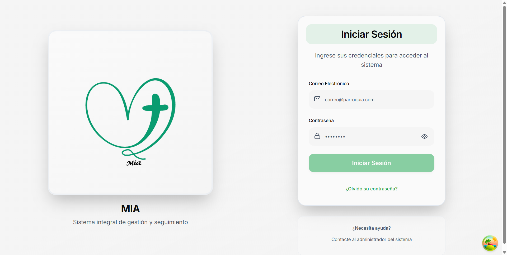

**Elementos de la pantalla:**

1. **Logo MIA**: Identidad visual del sistema
2. **Título**: "MIA - Sistema integral de gestión y seguimiento"
3. **Formulario de ingreso**:
   - Campo "Correo Electrónico"
   - Campo "Contraseña"
   - Botón "Iniciar Sesión"
4. **Opciones adicionales**:
   - Enlace "¿Olvidó su contraseña?"
   - Información de contacto con el administrador

### 2.2 Proceso de Inicio de Sesión

**Paso 1:** Ingrese su correo electrónico en el campo correspondiente

**Paso 2:** Ingrese su contraseña en el campo "Contraseña"


**Paso 3:** Haga clic en el botón **"Iniciar Sesión"**

**Paso 4:** El sistema validará sus credenciales y mostrará un mensaje de verificación

### 2.3 Credenciales de Ejemplo

Para propósitos de demostración, puede utilizar las siguientes credenciales de administrador:

```
Correo Electrónico: admin@parroquia.com
Contraseña: Admin123!
```

> ⚠️ **IMPORTANTE:** Estas son credenciales de ejemplo. En producción, cada usuario debe tener sus propias credenciales únicas y seguras.

### 2.4 Recuperación de Contraseña

Si olvidó su contraseña:

1. Haga clic en **"¿Olvidó su contraseña?"**
2. Ingrese su correo electrónico registrado
3. Revise su bandeja de entrada para el enlace de recuperación
4. Siga las instrucciones del correo para restablecer su contraseña

### 2.5 Confirmación de Acceso

Una vez autenticado correctamente, el sistema mostrará:

- ✅ Mensaje de bienvenida con su nombre
- ✅ Redirección automática al Dashboard principal
- ✅ Menú de navegación lateral disponible

---

## 3. Panel de Control (Dashboard)

### 3.1 Vista General del Dashboard

El Dashboard es la pantalla principal después de iniciar sesión. Proporciona una vista completa de las estadísticas del sistema.

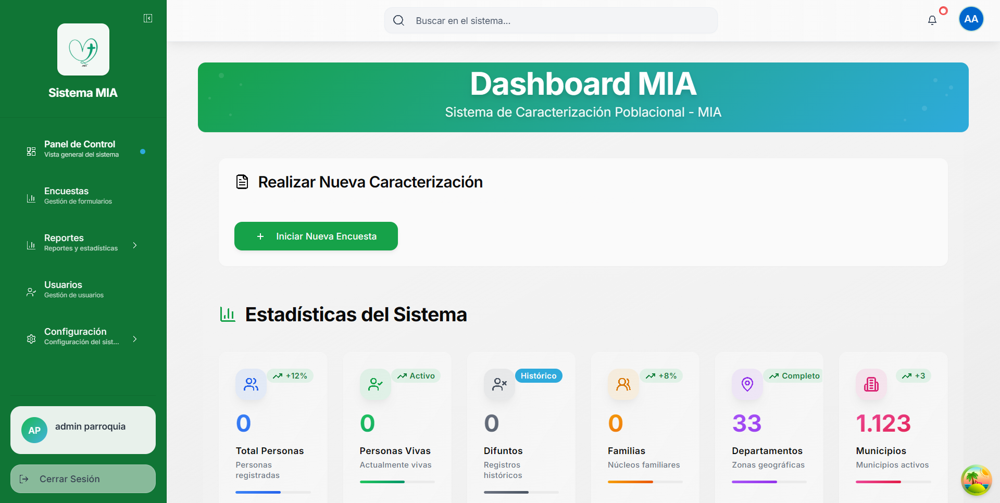

### 3.2 Componentes del Dashboard

#### 3.2.1 Barra Superior (Header)

**Elementos:**
- 🔍 **Buscador global**: Permite buscar en todo el sistema
- 👤 **Menú de usuario**: Acceso a perfil y cerrar sesión
- 🔔 **Notificaciones**: Alertas y mensajes del sistema

#### 3.2.2 Menú Lateral (Sidebar)

El menú lateral proporciona acceso rápido a todas las funcionalidades:

1. **📊 Panel de Control**: Vista general del sistema (pantalla actual)
2. **📋 Encuestas**: Gestión de formularios de caracterización
3. **📈 Reportes**: Reportes y estadísticas avanzadas
4. **👥 Usuarios**: Gestión de usuarios del sistema
5. **⚙️ Configuración**: Configuración de catálogos y sistema

**Características del Sidebar:**
- 🔽 **Colapsible**: Puede ocultarse para mayor espacio
- 💡 **Tooltips**: Muestra descripciones al pasar el mouse
- 🎯 **Indicador activo**: Resalta la sección actual

#### 3.2.3 Botón de Acción Rápida

**"Iniciar Nueva Encuesta"**: Botón destacado para comenzar una nueva caracterización poblacional.

- **Ubicación**: Parte superior del dashboard
- **Función**: Acceso directo al formulario de encuesta
- **Color**: Verde (acción principal)

### 3.3 Tarjetas de Estadísticas Principales

#### 3.3.1 Estadísticas Poblacionales

**Total Personas**
- Muestra el número total de personas registradas
- Indicador de tendencia (+12%)
- Incluye todas las personas (vivas y difuntos)

**Personas Vivas**
- Contador de personas actualmente vivas
- Estado: "Activo"
- Se actualiza con cada encuesta

**Difuntos**
- Registro histórico de personas fallecidas
- Estado: "Histórico"
- Importante para análisis demográfico

**Familias**
- Número de núcleos familiares registrados
- Indicador de crecimiento (+8%)
- Base para caracterización familiar

#### 3.3.2 Estadísticas Geográficas

**Departamentos**
- Total: 33 departamentos disponibles
- Estado: "Completo"
- Cobertura nacional

**Municipios**
- Total: 1,123 municipios activos
- Indicador: +3 nuevos
- Permite caracterización por ubicación

### 3.4 Estadísticas de Salud

Esta sección muestra un análisis completo del estado de salud poblacional:

**Métricas Principales:**

1. **Total Personas**: 100% del universo de análisis
2. **Con Enfermedades**: Porcentaje de personas con condiciones médicas
3. **Personas Sanas**: Porcentaje sin enfermedades registradas
4. **Familias Afectadas**: Familias con al menos un miembro enfermo

**Enfermedades Más Comunes:**
- Lista top 6 de condiciones de salud
- Gráfico de distribución por sexo y edad
- Análisis de casos registrados

### 3.5 Estadísticas Profesionales

#### 3.5.1 Profesiones

**Datos mostrados:**
- Porcentaje con profesión
- Porcentaje sin profesión
- Top 5 profesiones más comunes
- 11 tipos de profesiones disponibles

**Detalles Adicionales:**
- Con Profesión y Habilidades
- Solo Profesión

#### 3.5.2 Habilidades

**Métricas:**
- Familias con habilidades
- Especialistas (solo habilidades)
- 20 tipos de habilidades técnicas

**Top Habilidades:**
- Lista de habilidades más comunes
- Análisis de competencias técnicas

### 3.6 Vivienda y Servicios

Esta sección analiza la infraestructura y servicios básicos:

**Componentes:**

1. **Total Familias**: Universo de análisis
2. **Tipos de Vivienda**: Distribución por tipo
3. **Sistemas de Acueducto**: Acceso a agua potable
4. **Aguas Residuales**: Manejo de desechos

**Gráficos incluidos:**
- Distribución de tipos de vivienda
- Porcentaje con acueducto municipal
- Sistema de aguas residuales

### 3.7 Interpretación de las Estadísticas

**Códigos de Color:**
- 🟢 **Verde**: Indicadores positivos o en crecimiento
- 🔵 **Azul**: Información estándar
- 🟡 **Amarillo**: Requiere atención
- 🔴 **Rojo**: Situación crítica

**Indicadores de Tendencia:**
- ⬆️ **Porcentaje positivo**: Crecimiento respecto al período anterior
- ⬇️ **Porcentaje negativo**: Decrecimiento
- ➡️ **Sin cambio**: Estable

### 3.8 Actualización de Datos

Las estadísticas del dashboard se actualizan:

- ✅ **Automáticamente**: Al cargar la página
- ✅ **En tiempo real**: Después de crear/editar encuestas
- ✅ **Manualmente**: Haciendo clic en el botón de recarga (si disponible)

---

## 4. Gestión de Catálogos

### 4.1 ¿Qué son los Catálogos?

Los catálogos son listados maestros de información que se utilizan en las encuestas. Estos catálogos permiten:

- ✅ Estandarizar la información ingresada
- ✅ Mantener consistencia en los datos
- ✅ Facilitar el análisis estadístico
- ✅ Evitar duplicados y errores de digitación

### 4.2 Acceso a los Catálogos

Para acceder a los catálogos:

**Paso 1:** Haga clic en el menú **"Configuración"** en el sidebar izquierdo

**Paso 2:** El menú se expandirá mostrando todos los catálogos disponibles

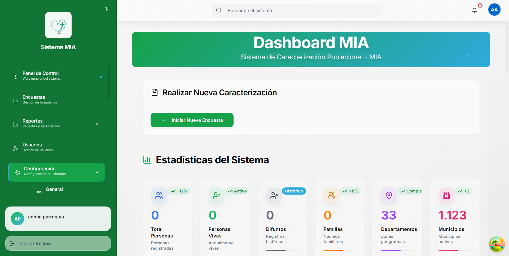

### 4.3 Catálogos Disponibles

El sistema MIA incluye los siguientes catálogos:

#### 4.3.1 Catálogos Geográficos

1. **Departamentos**: Departamentos del país (33 departamentos)
2. **Municipios**: Municipios de Colombia (1,123 municipios)
3. **Corregimientos**: Subdivisiones municipales
4. **Centros Poblados**: Núcleos urbanos secundarios
5. **Veredas**: Divisiones rurales
6. **Sectores**: Sectores del sistema

#### 4.3.2 Catálogos Organizacionales

7. **Parroquias**: Gestión de parroquias católicas

#### 4.3.3 Catálogos de Salud

8. **Enfermedades**: Catálogo de condiciones médicas

#### 4.3.4 Catálogos Personales

9. **Sexos**: Categorías de género
10. **Estados Civiles**: Tipos de estado civil
11. **Tipos de Identificación**: Documentos de identidad (CC, TI, etc.)
12. **Parentescos**: Tipos de relación familiar

#### 4.3.5 Catálogos Educativos y Laborales

13. **Estudios**: Niveles educativos
14. **Profesiones**: Catálogo de profesiones (11 tipos)
15. **Habilidades**: Habilidades profesionales (20 tipos)
16. **Destrezas**: Destrezas técnicas

#### 4.3.6 Catálogos de Vivienda

17. **Tipos de Vivienda**: Clasificación de viviendas
18. **Aguas Residuales**: Sistemas de manejo de desechos
19. **Disposición de Basura**: Métodos de disposición de residuos

#### 4.3.7 Catálogos Culturales

20. **Comunidades Culturales**: Comunidades étnicas y culturales

### 4.4 Gestión de Municipios (Ejemplo Detallado)

Los municipios son uno de los catálogos más importantes del sistema. Veamos cómo gestionarlos:

#### 4.4.1 Acceso al Catálogo de Municipios

**Paso 1:** En el menú **"Configuración"**, haga clic en **"Municipios"**

**Paso 2:** Se mostrará la pantalla de gestión de municipios

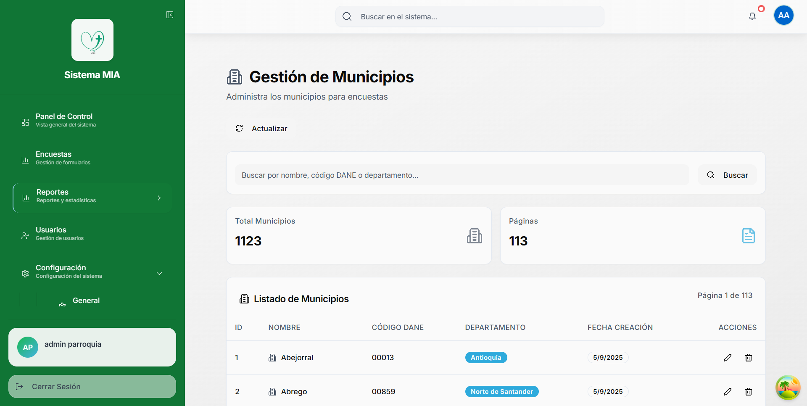

#### 4.4.2 Componentes de la Pantalla

**Encabezado:**
- Título: "Gestión de Municipios"
- Descripción: "Administra los municipios para encuestas"
- Botón "Actualizar": Recarga los datos

**Buscador:**
- Campo de búsqueda: "Buscar por nombre, código DANE o departamento..."
- Botón "Buscar": Ejecuta la búsqueda

**Estadísticas:**
- Total Municipios: 1,123
- Páginas: 113

#### 4.4.3 Tabla de Municipios

La tabla muestra las siguientes columnas:

| Columna | Descripción |
|---------|-------------|
| **ID** | Identificador único del municipio |
| **NOMBRE** | Nombre del municipio |
| **CÓDIGO DANE** | Código DANE oficial |
| **DEPARTAMENTO** | Departamento al que pertenece |
| **FECHA CREACIÓN** | Fecha de registro en el sistema |
| **ACCIONES** | Botones Editar y Eliminar |

#### 4.4.4 Buscar Municipios

**Paso 1:** Escriba el término de búsqueda en el campo correspondiente

Puede buscar por:
- Nombre del municipio (ej: "Medellín")
- Código DANE (ej: "00013")
- Nombre del departamento (ej: "Antioquia")

**Paso 2:** Haga clic en el botón **"Buscar"** o presione Enter

**Paso 3:** La tabla mostrará solo los resultados que coincidan con la búsqueda

#### 4.4.5 Paginación

El sistema muestra 10 registros por página por defecto.

**Para navegar entre páginas:**
- Botones numéricos (1, 2, 3, 4, ..., 113)
- Botón "Anterior": Página anterior
- Botón "Siguiente": Página siguiente

**Para cambiar el número de registros por página:**
1. Haga clic en el selector "Mostrar"
2. Seleccione 10, 20, 50 o 100 registros por página

**Información mostrada:**
- "Mostrando 1-10 de 1123 registros"
- Página actual y total de páginas

#### 4.4.6 Editar un Municipio

> ⚠️ **IMPORTANTE:** Los municipios vienen precargados con información oficial. Solo edite si es absolutamente necesario.

**Paso 1:** Ubique el municipio que desea editar

**Paso 2:** Haga clic en el botón **"Editar"** de la fila correspondiente

**Paso 3:** Se abrirá un formulario modal con los datos del municipio

**Paso 4:** Modifique los campos necesarios:
- Nombre
- Código DANE
- Departamento

**Paso 5:** Haga clic en **"Guardar"** para aplicar los cambios

**Paso 6:** El sistema mostrará una notificación de confirmación

#### 4.4.7 Eliminar un Municipio

> ⚠️ **ADVERTENCIA:** No se puede eliminar un municipio si tiene encuestas asociadas.

**Paso 1:** Ubique el municipio que desea eliminar

**Paso 2:** Haga clic en el botón **"Eliminar"**

**Paso 3:** Aparecerá un mensaje de confirmación

**Paso 4:** Confirme la eliminación haciendo clic en **"Sí, eliminar"**

**Paso 5:** El municipio será eliminado y la tabla se actualizará

#### 4.4.8 Actualizar el Listado

Para refrescar los datos:

**Paso 1:** Haga clic en el botón **"Actualizar"** en la parte superior

**Paso 2:** El sistema cargará los datos más recientes de la base de datos

### 4.5 Gestión de Otros Catálogos

Los demás catálogos funcionan de manera similar a Municipios. Todos incluyen:

- ✅ **Listado con paginación**
- ✅ **Buscador**
- ✅ **Botones Editar/Eliminar**
- ✅ **Contador de registros**
- ✅ **Botón Actualizar**

**Catálogos con funcionalidades especiales:**

#### 4.5.1 Enfermedades

**Campos específicos:**
- Nombre de la enfermedad
- Código CIE-10 (si aplica)
- Categoría (Crónica, Aguda, etc.)

#### 4.5.2 Profesiones

**Campos específicos:**
- Nombre de la profesión
- Categoría laboral
- Nivel educativo requerido

#### 4.5.3 Habilidades

**Campos específicos:**
- Nombre de la habilidad
- Tipo (Técnica, Artística, Deportiva, etc.)
- Nivel (Básico, Intermedio, Avanzado)

### 4.6 Mejores Prácticas para Catálogos

**DO ✅:**
- Revise los catálogos antes de crear encuestas
- Use el buscador para localizar registros rápidamente
- Mantenga los nombres estandarizados y claros
- Actualice regularmente si hay cambios oficiales

**DON'T ❌:**
- No elimine registros con datos asociados
- No cree duplicados de registros existentes
- No modifique códigos oficiales (DANE, CIE-10, etc.)
- No use abreviaturas confusas

### 4.7 Casos de Uso Comunes

**Caso 1: Agregar una nueva enfermedad**

1. Ir a Configuración > Enfermedades
2. Clic en "Agregar Nueva Enfermedad"
3. Llenar el formulario con nombre y código
4. Guardar

**Caso 2: Verificar si existe un municipio**

1. Ir a Configuración > Municipios
2. Usar el buscador con el nombre del municipio
3. Si no aparece, contactar al administrador

**Caso 3: Actualizar el nombre de una profesión**

1. Ir a Configuración > Profesiones
2. Buscar la profesión
3. Clic en Editar
4. Modificar el nombre
5. Guardar cambios

---

## 5. Gestión de Encuestas

### 5.1 ¿Qué es una Encuesta de Caracterización?

La encuesta de caracterización poblacional es el núcleo del sistema MIA. Permite registrar información detallada sobre:

- ✅ Ubicación geográfica y administrativa
- ✅ Información de vivienda y servicios básicos
- ✅ Composición familiar
- ✅ Datos demográficos, educativos y laborales
- ✅ Información de salud
- ✅ Registros de difuntos
- ✅ Observaciones y consentimientos

### 5.2 Acceso al Módulo de Encuestas

**Paso 1:** Haga clic en **"Encuestas"** en el menú lateral

**Paso 2:** Se mostrará la pantalla de gestión de encuestas

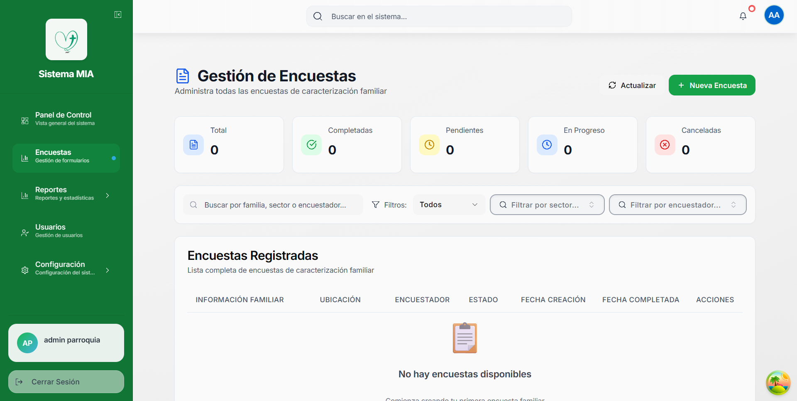

### 5.3 Pantalla de Gestión de Encuestas

#### 5.3.1 Componentes Principales

**Encabezado:**
- Título: "Gestión de Encuestas"
- Descripción: "Administra todas las encuestas de caracterización familiar"
- Botón "Actualizar": Recarga el listado
- Botón "Nueva Encuesta": Inicia una nueva caracterización

**Estadísticas de Encuestas:**
- **Total**: Número total de encuestas registradas
- **Completadas**: Encuestas finalizadas
- **Pendientes**: Encuestas por completar
- **En Progreso**: Encuestas en proceso de llenado
- **Canceladas**: Encuestas descartadas

**Filtros de Búsqueda:**
- Campo de búsqueda: "Buscar por familia, sector o encuestador..."
- Filtro por estado: Todos, Completadas, Pendientes, etc.
- Filtro por sector
- Filtro por encuestador

#### 5.3.2 Tabla de Encuestas

Cuando hay encuestas registradas, la tabla muestra:

| Columna | Descripción |
|---------|-------------|
| **INFORMACIÓN FAMILIAR** | Apellido familiar y número de miembros |
| **UBICACIÓN** | Municipio, sector, dirección |
| **ENCUESTADOR** | Usuario que creó la encuesta |
| **ESTADO** | Estado actual (Completada, Pendiente, etc.) |
| **FECHA CREACIÓN** | Fecha de registro |
| **FECHA COMPLETADA** | Fecha de finalización |
| **ACCIONES** | Ver, Editar, Eliminar |

#### 5.3.3 Estados de las Encuestas

- 🟢 **Completada**: Encuesta finalizada y guardada
- 🟡 **En Progreso**: Encuesta iniciada pero no completada
- ⚪ **Pendiente**: Encuesta creada pero sin datos
- 🔴 **Cancelada**: Encuesta descartada

### 5.4 Crear una Nueva Encuesta

#### 5.4.1 Iniciar el Proceso

**Opción 1: Desde el Dashboard**
1. Haga clic en el botón verde **"Iniciar Nueva Encuesta"** del Dashboard

**Opción 2: Desde Gestión de Encuestas**
1. Navegue a **Encuestas** en el menú lateral
2. Haga clic en el botón **"Nueva Encuesta"**

**Opción 3: Desde tabla vacía**
1. En la pantalla de encuestas vacía
2. Haga clic en **"📝 Nueva Encuesta"**

#### 5.4.2 Estructura del Formulario de Encuesta

El formulario está dividido en **6 etapas** secuenciales:

1. 📍 **Información General** (Etapa 1)
2. 🏠 **Información de Vivienda y Basuras** (Etapa 2)
3. 💧 **Acueducto y Aguas Residuales** (Etapa 3)
4. 👨‍👩‍👧‍👦 **Información Familiar** (Etapa 4)
5. 🕊️ **Difuntos de la Familia** (Etapa 5)
6. 📝 **Observaciones y Consentimiento** (Etapa 6)

**Características del formulario:**
- ✅ Indicador de progreso visual
- ✅ Navegación entre etapas
- ✅ Guardado automático (borrador)
- ✅ Validación en tiempo real
- ✅ Campos obligatorios marcados con (*)

### 5.5 Etapa 1: Información General

Esta es la primera etapa del formulario de caracterización.

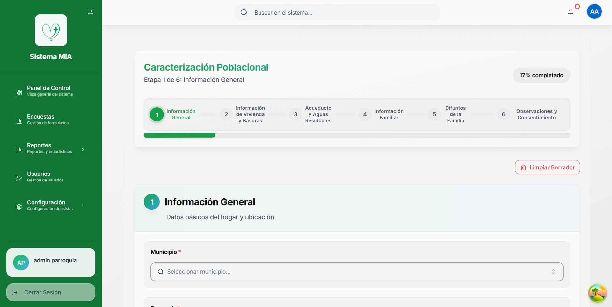

#### 5.5.1 Campos de la Etapa 1

**Campos Obligatorios (*):**

1. **Municipio** *
   - Selector desplegable con búsqueda
   - 1,123 municipios disponibles
   - Filtra corregimientos y centros poblados
   - **Cómo usar**: Haga clic y escriba para buscar

2. **Parroquia** *
   - Selector de parroquia católica
   - Depende del municipio seleccionado
   - **Cómo usar**: Seleccione de la lista desplegable

3. **Fecha** *
   - Fecha de registro de la encuesta
   - **Por defecto**: Fecha y hora actual
   - **Estado**: Bloqueado (no editable)
   - **Formato**: "DD de MMMM de YYYY HH:mm"

4. **Apellido Familiar** *
   - Apellido de la familia encuestada
   - Campo de texto libre
   - **Validación**: Mínimo 2 caracteres
   - **Ejemplo**: "González", "Rodríguez Martínez"

**Campos Opcionales:**

5. **Corregimiento**
   - Subdivisión del municipio
   - **Dependencia**: Se filtra según municipio
   - **Estado**: Deshabilitado hasta seleccionar municipio

6. **Centro Poblado**
   - Núcleo urbano secundario
   - **Dependencia**: Se filtra según corregimiento/municipio

7. **Vereda**
   - División rural
   - **Dependencia**: Se filtra según municipio

8. **Sector**
   - Sector específico dentro de la ubicación
   - Selector desplegable

9. **Dirección**
   - Dirección física del hogar
   - Campo de texto libre
   - **Ejemplo**: "Calle 50 # 45-32"

10. **Teléfono**
    - Número de contacto de la familia
    - **Formato**: Texto libre (permite varios formatos)

11. **Número Contrato EPM**
    - Número de contrato de servicios públicos
    - Campo de texto

#### 5.5.2 Funcionalidades Especiales

**Dependencias Jerárquicas:**

El formulario implementa filtrado jerárquico automático:

```
Departamento
    └── Municipio *
        ├── Corregimiento
        │   └── Centro Poblado
        └── Vereda
```

**Ejemplo de flujo:**
1. Selecciono "Antioquia" (Departamento)
2. Selecciono "Medellín" (Municipio)
3. Aparecen solo los corregimientos de Medellín
4. Selecciono "Santa Elena" (Corregimiento)
5. Aparecen solo los centros poblados de Santa Elena

**Selector con Búsqueda:**

Los selectores de Municipio, Parroquia, etc. incluyen:
- 🔍 **Búsqueda en tiempo real**
- ⌨️ **Autocompletado**
- 📋 **Lista virtual** (carga rápida de miles de registros)

**Pasos para usar el selector:**

1. Haga clic en el campo "Municipio"
2. Se abrirá un cuadro de diálogo
3. Escriba las primeras letras (ej: "Med")
4. Aparecerán opciones filtradas
5. Haga clic en la opción deseada
6. El campo se llenará automáticamente

#### 5.5.3 Botón "Limpiar Borrador"

- **Ubicación**: Esquina superior derecha del formulario
- **Función**: Elimina todos los datos del borrador actual
- **Confirmación**: Muestra mensaje de confirmación antes de eliminar
- ⚠️ **ADVERTENCIA**: Esta acción no se puede deshacer

**Cuándo usar:**
- Para iniciar una nueva encuesta desde cero
- Si se registraron datos incorrectos
- Si se desea cancelar la encuesta actual

#### 5.5.4 Navegación

**Botón "Siguiente":**
- **Ubicación**: Parte inferior del formulario
- **Función**: Avanza a la Etapa 2
- **Validación**: Solo avanza si los campos obligatorios están completos
- **Guardado**: Guarda automáticamente como borrador antes de avanzar

**Indicador de Progreso:**
- **Ubicación**: Parte superior del formulario
- **Formato**: Barra de progreso visual + porcentaje
- **Ejemplo**: "17% completado" (Etapa 1 de 6)
- **Código de colores**:
  - 🟦 **Azul**: Etapa actual
  - ⚪ **Gris**: Etapas pendientes
  - 🟢 **Verde**: Etapas completadas

### 5.6 Etapa 2: Información de Vivienda y Basuras

Esta etapa registra datos sobre la vivienda y el manejo de residuos.

#### 5.6.1 Campos de la Etapa 2

**Tipo de Vivienda:**
- Selector desplegable
- Opciones: Casa, Apartamento, Rancho, etc.

**Disposición de Basura:**
- Selector múltiple (pueden seleccionarse varias opciones)
- Opciones: Recolección municipal, Quema, Entierro, etc.

**Observaciones de Vivienda:**
- Campo de texto libre
- Para notas adicionales sobre la vivienda

#### 5.6.2 Navegación

- **Botón "Anterior"**: Regresa a Etapa 1
- **Botón "Siguiente"**: Avanza a Etapa 3

### 5.7 Etapa 3: Acueducto y Aguas Residuales

Registra información sobre servicios de agua y saneamiento.

#### 5.7.1 Campos de la Etapa 3

**Sistema de Acueducto:**
- Selector desplegable
- Opciones: Acueducto Municipal, Pozo, Río, etc.

**Aguas Residuales:**
- Selector desplegable
- Opciones: Alcantarillado, Pozo Séptico, Campo Abierto, etc.

### 5.8 Etapa 4: Información Familiar

Esta es la etapa más importante y compleja del formulario.

#### 5.8.1 Gestión de Miembros de la Familia

**Características:**
- ✅ Tabla interactiva de miembros
- ✅ Agregar múltiples miembros
- ✅ Editar información de cada miembro
- ✅ Eliminar miembros
- ✅ Validación completa de datos

**Campos por Miembro:**

**Datos Personales:**
- Nombres y Apellidos *
- Tipo de Identificación *
- Número de Identificación *
- Sexo *
- Fecha de Nacimiento *
- Edad (calculada automáticamente)
- Estado Civil *
- Parentesco *

**Datos de Contacto:**
- Teléfono
- Email

**Datos Educativos:**
- Nivel de Estudios
- Profesión
- Habilidades (selector múltiple)
- Destrezas (selector múltiple)

**Datos de Salud:**
- Enfermedades (selector múltiple)
- Observaciones de salud

**Datos Culturales:**
- Comunidad Cultural/Étnica

#### 5.8.2 Agregar un Miembro de la Familia

**Paso 1:** Haga clic en el botón **"+ Agregar Miembro"**

**Paso 2:** Se abrirá un formulario modal

**Paso 3:** Complete los campos obligatorios (*)

**Paso 4:** Complete los campos opcionales según corresponda

**Paso 5:** Haga clic en **"Guardar"**

**Paso 6:** El miembro aparecerá en la tabla

#### 5.8.3 Editar un Miembro

**Paso 1:** Ubique el miembro en la tabla

**Paso 2:** Haga clic en el botón **"Editar"** (ícono de lápiz)

**Paso 3:** Se abrirá el formulario con los datos actuales

**Paso 4:** Modifique los campos necesarios

**Paso 5:** Haga clic en **"Guardar Cambios"**

#### 5.8.4 Eliminar un Miembro

**Paso 1:** Ubique el miembro en la tabla

**Paso 2:** Haga clic en el botón **"Eliminar"** (ícono de basura)

**Paso 3:** Confirme la eliminación en el mensaje que aparece

**Paso 4:** El miembro será removido de la tabla

### 5.9 Etapa 5: Difuntos de la Familia

Registro histórico de miembros fallecidos de la familia.

#### 5.9.1 Campos de Difuntos

**Datos del Difunto:**
- Nombres y Apellidos *
- Fecha de Fallecimiento *
- Causa de Fallecimiento
- Parentesco con la familia *
- Edad al fallecer
- Observaciones

#### 5.9.2 Gestión de Difuntos

Similar a la gestión de miembros familiares:
- Agregar difuntos
- Editar información
- Eliminar registros

### 5.10 Etapa 6: Observaciones y Consentimiento

Etapa final del formulario de encuesta.

#### 5.10.1 Campos de la Etapa 6

**Observaciones Generales:**
- Campo de texto amplio
- Para notas adicionales sobre la familia
- Información que no encaja en otros campos

**Consentimiento Informado:**
- Checkbox obligatorio *
- Confirma autorización para uso de datos
- **Texto**: "La familia autoriza el uso de esta información para fines estadísticos y pastorales de la parroquia"

**Información del Encuestador:**
- Nombre del encuestador (auto-completado)
- Fecha de registro (auto-completado)

#### 5.10.2 Finalizar la Encuesta

**Paso 1:** Complete las observaciones si es necesario

**Paso 2:** Marque la casilla de consentimiento *

**Paso 3:** Haga clic en el botón **"Finalizar Encuesta"**

**Paso 4:** El sistema validará toda la información

**Paso 5:** Si hay errores, se mostrarán mensajes específicos

**Paso 6:** Si todo está correcto, se mostrará confirmación de guardado

**Paso 7:** La encuesta cambiará a estado "Completada"

**Paso 8:** Será redirigido al listado de encuestas

### 5.11 Guardado Automático (Borrador)

El sistema guarda automáticamente los datos mientras completa la encuesta:

- ✅ **Frecuencia**: Cada 30 segundos
- ✅ **Almacenamiento**: LocalStorage del navegador
- ✅ **Recuperación**: Al recargar la página
- ✅ **Persistencia**: Hasta que finalice o elimine la encuesta

**Beneficios:**
- Protección contra cierre accidental del navegador
- Permite completar la encuesta en múltiples sesiones
- No requiere conexión constante a internet

**Limitaciones:**
- Solo funciona en el mismo navegador
- Se borra al "Limpiar Borrador"
- No sincroniza entre dispositivos

### 5.12 Validaciones del Formulario

El sistema implementa validaciones en múltiples niveles:

#### 5.12.1 Validaciones de Campos

**Campos Obligatorios:**
- Se marcan con asterisco rojo (*)
- No se puede avanzar sin completarlos
- Mensaje de error específico si están vacíos

**Formatos Específicos:**
- **Email**: Validación de formato válido
- **Fecha**: No permite fechas futuras (excepto configuradas)
- **Número de Identificación**: Solo números
- **Teléfono**: Formato flexible pero validado

#### 5.12.2 Validaciones Lógicas

**Edad vs Fecha de Nacimiento:**
- La edad se calcula automáticamente
- Debe coincidir con la fecha ingresada
- No permite fechas futuras

**Parentesco:**
- Validación de relaciones lógicas
- Al menos un "Jefe de Hogar" por familia

**Enfermedades:**
- Validación de selección múltiple
- Confirmación si selecciona enfermedades graves

### 5.13 Buscar y Filtrar Encuestas

Una vez creadas las encuestas, puede buscarlas y filtrarlas.

#### 5.13.1 Búsqueda por Texto

**Paso 1:** En el campo de búsqueda, escriba:
- Apellido familiar
- Nombre del sector
- Nombre del encuestador

**Paso 2:** La tabla se actualizará automáticamente

**Paso 3:** Muestra solo las encuestas que coincidan

#### 5.13.2 Filtros Avanzados

**Filtro por Estado:**
1. Haga clic en el selector "Filtrar por estado"
2. Seleccione: Todos, Completadas, Pendientes, etc.
3. La tabla se actualizará

**Filtro por Sector:**
1. Haga clic en "Filtrar por sector..."
2. Seleccione el sector deseado
3. Muestra solo encuestas de ese sector

**Filtro por Encuestador:**
1. Haga clic en "Filtrar por encuestador..."
2. Seleccione el usuario
3. Muestra solo encuestas de ese usuario

#### 5.13.3 Combinar Filtros

Puede combinar múltiples filtros simultáneamente:

**Ejemplo:**
- Búsqueda: "González"
- Estado: "Completadas"
- Sector: "Centro"
- Resultado: Solo encuestas de familias González, completadas, del sector Centro

### 5.14 Ver Detalles de una Encuesta

Para ver los detalles completos de una encuesta:

**Paso 1:** Ubique la encuesta en la tabla

**Paso 2:** Haga clic en el botón **"Ver"** (ícono de ojo)

**Paso 3:** Se abrirá la vista detallada

**La vista detallada muestra:**
- ✅ Todos los datos de la encuesta
- ✅ Información organizada por secciones
- ✅ Lista completa de miembros de la familia
- ✅ Difuntos registrados
- ✅ Observaciones
- ✅ Historial de cambios

### 5.15 Editar una Encuesta Existente

Puede editar encuestas después de crearlas:

**Paso 1:** Ubique la encuesta en la tabla

**Paso 2:** Haga clic en el botón **"Editar"** (ícono de lápiz)

**Paso 3:** Se abrirá el formulario con los datos actuales

**Paso 4:** Navegue por las etapas y modifique lo necesario

**Paso 5:** Haga clic en **"Guardar Cambios"** al finalizar

> ⚠️ **NOTA**: Al editar una encuesta completada, su estado puede cambiar a "En Progreso" hasta que se guarde nuevamente.

### 5.16 Eliminar una Encuesta

Para eliminar una encuesta:

**Paso 1:** Ubique la encuesta en la tabla

**Paso 2:** Haga clic en el botón **"Eliminar"** (ícono de basura)

**Paso 3:** Aparecerá un mensaje de confirmación

**Paso 4:** Haga clic en **"Sí, eliminar"** para confirmar

**Paso 5:** La encuesta será eliminada permanentemente

> ⚠️ **ADVERTENCIA**: Esta acción no se puede deshacer. Todos los datos de la encuesta se perderán.

### 5.17 Exportar Datos de Encuestas

El sistema permite exportar los datos:

**Formatos disponibles:**
- 📊 **Excel (.xlsx)**: Para análisis en Microsoft Excel
- 📄 **CSV (.csv)**: Para importar en otras aplicaciones
- 📄 **PDF (.pdf)**: Para impresión o archivo

**Paso 1:** En la pantalla de encuestas, busque el botón "Exportar"

**Paso 2:** Seleccione el formato deseado

**Paso 3:** Elija qué encuestas exportar (todas o filtradas)

**Paso 4:** Haga clic en "Descargar"

**Paso 5:** El archivo se descargará automáticamente

### 5.18 Mejores Prácticas para Encuestas

**DO ✅:**
- Complete todas las etapas en una sola sesión si es posible
- Verifique los datos antes de finalizar
- Use el campo de observaciones para notas importantes
- Revise la encuesta después de guardarla
- Mantenga actualizada la información familiar

**DON'T ❌:**
- No cierre el navegador sin guardar cambios
- No omita campos obligatorios intentando avanzar
- No registre datos ficticios o incorrectos
- No elimine encuestas por error
- No duplique encuestas de la misma familia

---

## 6. Reportes y Estadísticas

### 6.1 ¿Qué son los Reportes?

Los reportes son herramientas de análisis que permiten consultar, filtrar y exportar información registrada en el sistema. El sistema MIA ofrece reportes especializados para diferentes tipos de datos.

### 6.2 Acceso al Módulo de Reportes

**Paso 1:** Haga clic en **"Reportes"** en el menú lateral

**Paso 2:** El menú se expandirá mostrando las opciones disponibles

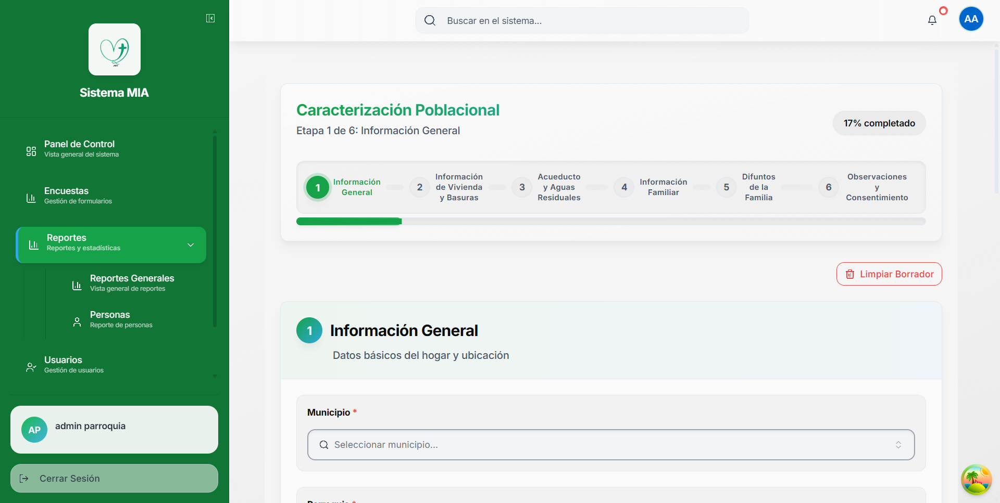

**Opciones disponibles:**
- **Reportes Generales**: Vista general de reportes
- **Personas**: Reporte específico de personas

### 6.3 Reportes Generales

Esta es la pantalla principal de reportes con múltiples pestañas.

#### 6.3.1 Acceso a Reportes Generales

**Paso 1:** En el menú Reportes, haga clic en **"Reportes Generales"**

**Paso 2:** Se mostrará la pantalla con tres pestañas:
- 👨‍👩‍👧‍👦 **Familias**
- 🏥 **Salud**
- 🕊️ **Difuntos**

### 6.4 Reporte de Familias

Este reporte permite consultar información de familias registradas con filtros avanzados.

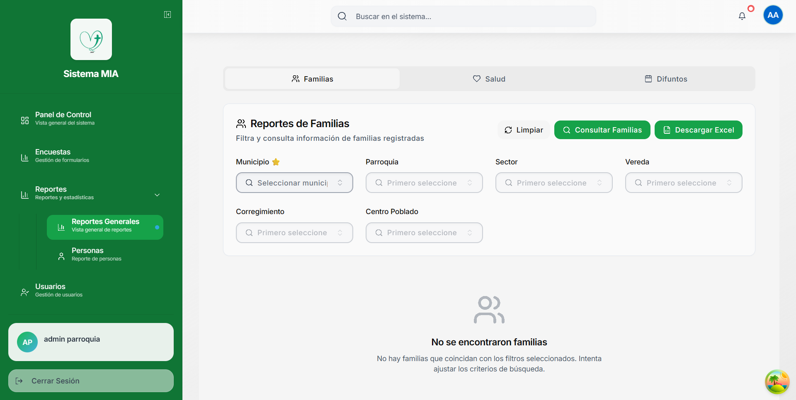

#### 6.4.1 Filtros Disponibles

**Filtros Jerárquicos:**

1. **Municipio** ⭐ (Obligatorio)
   - Selector con búsqueda
   - **Requisito**: Debe seleccionarse primero
   - Habilita los demás filtros

2. **Parroquia**
   - Se filtra según municipio seleccionado
   - Opcional

3. **Sector**
   - Se filtra según municipio
   - Opcional

4. **Vereda**
   - División rural del municipio
   - Opcional

5. **Corregimiento**
   - Subdivisión del municipio
   - Opcional

6. **Centro Poblado**
   - Núcleo urbano secundario
   - Opcional

#### 6.4.2 Uso del Reporte de Familias

**Paso 1: Seleccionar Municipio**
- Haga clic en "Seleccionar municipio..."
- Escriba para buscar
- Seleccione el municipio deseado
- Los demás filtros se habilitarán automáticamente

**Paso 2: Aplicar Filtros Adicionales (Opcional)**
- Seleccione parroquia, sector, vereda, etc.
- Puede combinar múltiples filtros

**Paso 3: Consultar**
- Haga clic en el botón **"Consultar Familias"**
- El sistema buscará las familias que coincidan

**Paso 4: Ver Resultados**
- Se mostrará una tabla con las familias encontradas
- Información mostrada por familia:
  - Apellido familiar
  - Número de miembros
  - Ubicación completa
  - Información de contacto

#### 6.4.3 Acciones Disponibles

**Botón "Limpiar":**
- Elimina todos los filtros seleccionados
- Regresa a estado inicial
- Permite iniciar nueva búsqueda

**Botón "Consultar Familias":**
- Ejecuta la búsqueda con los filtros actuales
- Muestra mensaje de éxito con número de resultados
- Actualiza la tabla de resultados

**Botón "Descargar Excel":**
- Se habilita después de consultar
- Exporta los resultados a archivo Excel (.xlsx)
- Incluye todas las columnas de la tabla

**Mensajes del Sistema:**
- ✅ "Consulta exitosa - Se encontraron X familias"
- ℹ️ "No se encontraron familias con los filtros seleccionados"
- ⚠️ "Debe seleccionar un municipio para consultar"

### 6.5 Reporte de Salud

Este reporte permite analizar personas con condiciones de salud específicas.

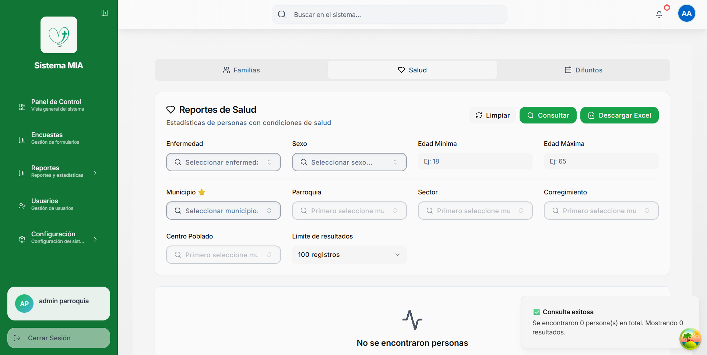

#### 6.5.1 Filtros Específicos de Salud

**Filtros de Condición:**

1. **Enfermedad**
   - Selector de enfermedades del catálogo
   - Permite buscar condición específica
   - Opcional

2. **Sexo**
   - Masculino, Femenino, Otro
   - Filtra por género
   - Opcional

3. **Edad Mínima**
   - Rango de 0 a 120 años
   - Límite inferior de edad
   - Opcional

4. **Edad Máxima**
   - Rango de 0 a 120 años
   - Límite superior de edad
   - Opcional

**Filtros Geográficos:**

5. **Municipio** ⭐ (Obligatorio)
6. **Parroquia** (Opcional)
7. **Sector** (Opcional)
8. **Corregimiento** (Opcional)
9. **Centro Poblado** (Opcional)

**Configuración Adicional:**

10. **Límite de resultados**
    - Opciones: 50, 100, 500, 1000, Todos
    - Por defecto: 100 registros
    - Previene sobrecarga de datos

#### 6.5.2 Uso del Reporte de Salud

**Ejemplo: Buscar personas con diabetes en Medellín**

**Paso 1:** Seleccione Municipio: "Medellín"

**Paso 2:** Seleccione Enfermedad: "Diabetes"

**Paso 3:** (Opcional) Configure rango de edad:
- Edad Mínima: 40
- Edad Máxima: 80

**Paso 4:** Haga clic en **"Consultar"**

**Paso 5:** Revise los resultados en la tabla

**Paso 6:** (Opcional) Haga clic en **"Descargar Excel"** para exportar

#### 6.5.3 Información Mostrada en Resultados

La tabla de resultados incluye:

- **Nombre Completo** de la persona
- **Edad** actual
- **Sexo**
- **Enfermedades** (puede tener múltiples)
- **Apellido Familiar**
- **Municipio y Sector**
- **Información de contacto**

#### 6.5.4 Casos de Uso Comunes

**Caso 1: Campaña de vacunación**
- Filtro: Edad Mínima 65
- Municipio: [Tu municipio]
- Objetivo: Identificar adultos mayores

**Caso 2: Seguimiento de enfermedades crónicas**
- Filtro: Enfermedad específica (ej: Hipertensión)
- Sector: [Tu sector]
- Objetivo: Visitas de seguimiento

**Caso 3: Estadísticas por género**
- Filtro: Enfermedad específica
- Sexo: Masculino/Femenino
- Objetivo: Análisis epidemiológico

### 6.6 Reporte de Difuntos

Este reporte consulta registros históricos de personas fallecidas.

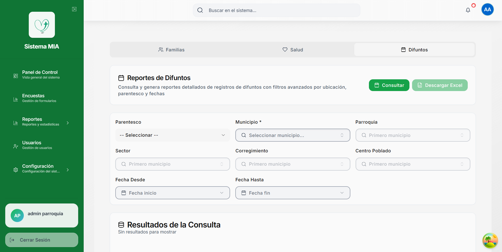

#### 6.6.1 Filtros del Reporte de Difuntos

**Filtros Específicos:**

1. **Parentesco**
   - Relación con la familia
   - Ejemplo: Abuelo, Padre, Hijo, etc.
   - Opcional

2. **Fecha Desde**
   - Fecha inicio del rango de fallecimiento
   - Selector de calendario
   - Opcional

3. **Fecha Hasta**
   - Fecha fin del rango de fallecimiento
   - Selector de calendario
   - Opcional

**Filtros Geográficos:**

4. **Municipio** * (Obligatorio)
5. **Parroquia** (Opcional)
6. **Sector** (Opcional)
7. **Corregimiento** (Opcional)
8. **Centro Poblado** (Opcional)

#### 6.6.2 Uso del Reporte de Difuntos

**Paso 1: Seleccionar Municipio**
- Obligatorio para habilitar demás filtros
- Seleccione el municipio a consultar

**Paso 2: Configurar Rango de Fechas (Opcional)**
- Haga clic en "Fecha inicio"
- Seleccione la fecha desde
- Haga clic en "Fecha fin"
- Seleccione la fecha hasta

**Paso 3: Aplicar Filtros Adicionales**
- Parentesco (si desea filtrar por relación)
- Ubicación específica (parroquia, sector, etc.)

**Paso 4: Consultar**
- Haga clic en el botón **"Consultar"**
- El sistema buscará los registros

**Paso 5: Revisar Resultados**
- Se mostrará tabla con los difuntos encontrados

#### 6.6.3 Información Mostrada

La tabla de resultados incluye las siguientes columnas:

| Columna | Descripción |
|---------|-------------|
| **FUENTE** | De dónde proviene el registro |
| **NOMBRE COMPLETO** | Nombre del difunto |
| **FECHA ANIVERSARIO** | Fecha de fallecimiento |
| **PARENTESCO** | Relación con la familia |
| **APELLIDO FAMILIAR** | Apellido de la familia |
| **SECTOR** | Sector de la familia |
| **TELÉFONO** | Contacto de la familia |
| **MUNICIPIO** | Municipio de la familia |
| **PARROQUIA** | Parroquia de la familia |
| **DIRECCIÓN** | Dirección de la familia |
| **OBSERVACIONES** | Notas adicionales |

#### 6.6.4 Características Especiales

**Múltiples Fuentes de Datos:**
- Registros de encuestas familiares
- Registros directos de difuntos
- Integración de diferentes fuentes

**Exportación Excel:**
- Incluye todas las columnas
- Formato listo para análisis
- Útil para reportes anuales

**Filtros Avanzados:**
- Combinación de múltiples criterios
- Búsqueda por rango de fechas
- Filtrado geográfico preciso

#### 6.6.5 Casos de Uso Comunes

**Caso 1: Aniversarios del Mes**
- Fecha Desde: 1 del mes actual
- Fecha Hasta: 30/31 del mes actual
- Objetivo: Enviar mensajes de condolencia

**Caso 2: Estadísticas Anuales**
- Fecha Desde: 1 de enero
- Fecha Hasta: 31 de diciembre
- Objetivo: Informe anual de fallecimientos

**Caso 3: Seguimiento por Sector**
- Sector: [Sector específico]
- Objetivo: Visitas pastorales por sector

### 6.7 Reporte de Personas

**Acceso:** Reportes > Personas

Este reporte especializado permite consultar información detallada de personas individuales con filtros exhaustivos.

**Filtros disponibles:**
- Datos personales (nombre, identificación, edad)
- Datos geográficos (municipio, sector, vereda)
- Datos educativos (nivel de estudios)
- Datos laborales (profesión, habilidades)
- Datos de salud (enfermedades)
- Estado civil y parentesco

### 6.8 Mejores Prácticas para Reportes

**DO ✅:**
- Seleccione siempre el municipio primero
- Use filtros específicos para resultados precisos
- Exporte a Excel para análisis adicional
- Guarde los reportes importantes
- Revise los resultados antes de exportar
- Use rangos de fechas lógicos
- Documente los criterios de búsqueda usados

**DON'T ❌:**
- No consulte sin filtros (demasiados resultados)
- No exporte datos sensibles innecesariamente
- No ignore los mensajes del sistema
- No olvide limpiar filtros entre búsquedas
- No use límites muy altos sin necesidad

### 6.9 Interpretación de Resultados

**Mensajes Comunes:**

✅ **"Consulta exitosa - Se encontraron X registros"**
- La búsqueda fue exitosa
- X es el número de resultados encontrados
- Puede proceder a revisar o exportar

ℹ️ **"No se encontraron registros"**
- No hay datos que coincidan con los filtros
- Intente ajustar los criterios
- Verifique que los datos existen en el sistema

⚠️ **"Debe seleccionar un municipio"**
- El filtro de municipio es obligatorio
- Selecciónelo para continuar

🔍 **"Buscando registros..."**
- La consulta está en proceso
- Espere a que termine la búsqueda

### 6.10 Exportación de Datos

Todos los reportes permiten exportar a Excel:

**Paso 1:** Ejecute la consulta con los filtros deseados

**Paso 2:** Verifique que los resultados son correctos

**Paso 3:** Haga clic en el botón **"Descargar Excel"**

**Paso 4:** El archivo se descargará automáticamente

**Paso 5:** Abra el archivo en Microsoft Excel o software compatible

**Contenido del Excel:**
- Todas las columnas visibles en la tabla
- Formato tabular listo para análisis
- Encabezados descriptivos
- Datos sin formato (para procesamiento)

**Usos del Excel exportado:**
- Crear gráficos y tablas dinámicas
- Análisis estadístico avanzado
- Compartir con otros departamentos
- Archivar para registros históricos
- Imprimir reportes físicos

---

## 7. Gestión de Usuarios

### 7.1 ¿Qué es la Gestión de Usuarios?

El módulo de usuarios permite crear, editar y administrar las cuentas de acceso al sistema MIA. Solo los administradores tienen acceso a esta funcionalidad.

### 7.2 Acceso al Módulo de Usuarios

**Paso 1:** Haga clic en **"Usuarios"** en el menú lateral

**Paso 2:** Se mostrará la pantalla de gestión de usuarios

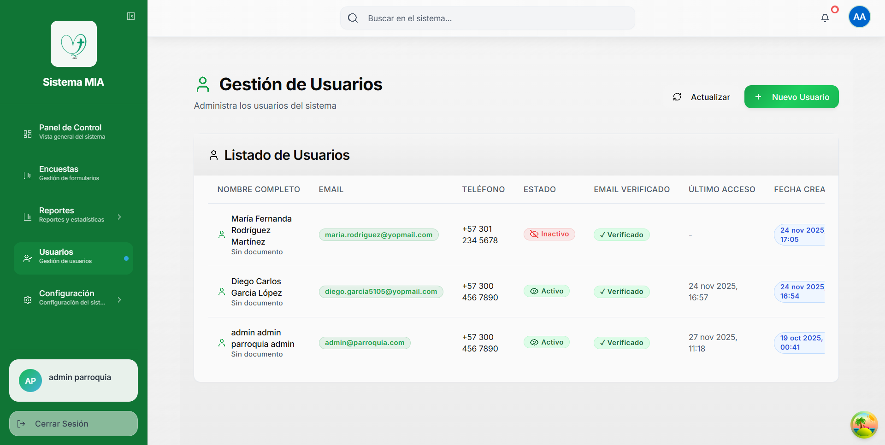

### 7.3 Pantalla de Gestión de Usuarios

#### 7.3.1 Componentes Principales

**Encabezado:**
- Título: "Gestión de Usuarios"
- Descripción: "Administra los usuarios del sistema"
- Botón "Actualizar": Recarga el listado
- Botón "Nuevo Usuario": Crea un nuevo usuario

#### 7.3.2 Tabla de Usuarios

La tabla muestra las siguientes columnas:

| Columna | Descripción |
|---------|-------------|
| **NOMBRE COMPLETO** | Nombre completo del usuario |
| **EMAIL** | Correo electrónico (usado para login) |
| **TELÉFONO** | Número de contacto |
| **ESTADO** | Activo o Inactivo |
| **EMAIL VERIFICADO** | Si el email fue confirmado |
| **ÚLTIMO ACCESO** | Última vez que inició sesión |
| **FECHA CREACIÓN** | Fecha de registro en el sistema |
| **ACCIONES** | Botones Editar y Eliminar |

#### 7.3.3 Estados de Usuario

🟢 **Activo:**
- Puede iniciar sesión normalmente
- Tiene acceso completo al sistema
- Puede crear y editar encuestas

🔴 **Inactivo:**
- No puede iniciar sesión
- Cuenta temporalmente deshabilitada
- Los datos se conservan

✓ **Email Verificado:**
- El usuario confirmó su correo electrónico
- Puede usar todas las funcionalidades

✗ **Email No Verificado:**
- El usuario aún no confirmó su email
- Puede tener acceso limitado

### 7.4 Crear un Nuevo Usuario

**Paso 1:** Haga clic en el botón **"Nuevo Usuario"**

**Paso 2:** Se abrirá un formulario modal

**Paso 3:** Complete los campos obligatorios:

**Datos Personales:**
- **Nombres** * (Requerido)
- **Apellidos** * (Requerido)
- **Tipo de Identificación** (CC, TI, etc.)
- **Número de Identificación**

**Datos de Acceso:**
- **Email** * (Requerido, único en el sistema)
- **Contraseña** * (Requerido, mínimo 8 caracteres)
- **Confirmar Contraseña** * (Debe coincidir)

**Datos de Contacto:**
- **Teléfono** * (Requerido)
- **Dirección**

**Configuración de Cuenta:**
- **Estado**: Activo / Inactivo
- **Rol**: Administrador / Usuario / Encuestador

**Paso 4:** Haga clic en **"Guardar Usuario"**

**Paso 5:** El sistema validará los datos:
- Email no debe estar duplicado
- Contraseñas deben coincidir
- Todos los campos obligatorios completos

**Paso 6:** Si todo es correcto:
- Se mostrará mensaje de confirmación
- El usuario aparecerá en la tabla
- Se enviará email de bienvenida (si está configurado)

### 7.5 Editar un Usuario Existente

**Paso 1:** Ubique el usuario en la tabla

**Paso 2:** Haga clic en el botón **"Editar"** (ícono de lápiz)

**Paso 3:** Se abrirá el formulario con los datos actuales

**Paso 4:** Modifique los campos necesarios:
- Puede cambiar todos los datos excepto el email
- Para cambiar email, debe crear nuevo usuario

**Paso 5:** Haga clic en **"Guardar Cambios"**

**Paso 6:** Los cambios se aplicarán inmediatamente

**Campos editables:**
- ✅ Nombres y apellidos
- ✅ Teléfono y dirección
- ✅ Estado (Activo/Inactivo)
- ✅ Rol del usuario
- ✅ Contraseña (opcional)

**Campos no editables:**
- ❌ Email (identificador único)
- ❌ Fecha de creación
- ❌ Historial de accesos

### 7.6 Desactivar / Activar un Usuario

Para desactivar temporalmente un usuario sin eliminarlo:

**Paso 1:** Haga clic en **"Editar"** del usuario

**Paso 2:** Cambie el **Estado** a "Inactivo"

**Paso 3:** Guarde los cambios

**Resultado:**
- El usuario no podrá iniciar sesión
- Sus datos se conservan
- Sus encuestas creadas permanecen
- Puede reactivarse en cualquier momento

**Para reactivar:**
- Siga los mismos pasos y cambie a "Activo"

### 7.7 Eliminar un Usuario

> ⚠️ **ADVERTENCIA CRÍTICA**: Eliminar un usuario es una acción permanente. Se recomienda desactivar en lugar de eliminar.

**Paso 1:** Ubique el usuario en la tabla

**Paso 2:** Haga clic en el botón **"Eliminar"** (ícono de basura)

**Paso 3:** Aparecerá un mensaje de confirmación:
> "¿Está seguro de eliminar este usuario? Esta acción no se puede deshacer. Las encuestas creadas por este usuario permanecerán en el sistema."

**Paso 4:** Si está seguro, haga clic en **"Sí, eliminar"**

**Paso 5:** El usuario será eliminado permanentemente

**Qué se elimina:**
- ❌ Cuenta de usuario
- ❌ Credenciales de acceso
- ❌ Datos personales del usuario

**Qué se conserva:**
- ✅ Encuestas creadas por el usuario
- ✅ Datos de familias registradas
- ✅ Registros asociados en reportes

### 7.8 Roles de Usuario

El sistema MIA maneja diferentes roles con permisos específicos:

#### 7.8.1 Administrador

**Permisos:**
- ✅ Acceso completo al sistema
- ✅ Crear, editar y eliminar usuarios
- ✅ Gestionar catálogos del sistema
- ✅ Acceder a todos los reportes
- ✅ Crear y editar encuestas
- ✅ Ver todas las encuestas del sistema
- ✅ Exportar datos
- ✅ Configurar el sistema

#### 7.8.2 Usuario / Encuestador

**Permisos:**
- ✅ Crear encuestas
- ✅ Editar sus propias encuestas
- ✅ Ver encuestas creadas por él
- ✅ Acceder a reportes básicos
- ✅ Exportar sus propios datos
- ❌ No puede gestionar usuarios
- ❌ No puede editar catálogos
- ❌ No puede ver encuestas de otros usuarios

#### 7.8.3 Visualizador (Si está disponible)

**Permisos:**
- ✅ Ver encuestas existentes
- ✅ Acceder a reportes y estadísticas
- ✅ Exportar reportes
- ❌ No puede crear encuestas
- ❌ No puede editar datos
- ❌ No puede gestionar usuarios

### 7.9 Restablecer Contraseña

Si un usuario olvidó su contraseña, el administrador puede restablecerla:

**Paso 1:** Haga clic en **"Editar"** del usuario

**Paso 2:** En el campo **"Nueva Contraseña"**, ingrese una contraseña temporal

**Paso 3:** Confirme la contraseña

**Paso 4:** Guarde los cambios

**Paso 5:** Comunique al usuario la contraseña temporal

**Paso 6:** El usuario debe cambiarla en su primer acceso

**Requisitos de contraseña:**
- Mínimo 8 caracteres
- Al menos una letra mayúscula
- Al menos una letra minúscula
- Al menos un número
- Caracteres especiales (recomendado)

### 7.10 Ver Último Acceso de Usuarios

La columna "ÚLTIMO ACCESO" muestra:

**Formato:** "DD MMM AAAA, HH:mm"

**Ejemplos:**
- "27 nov 2025, 11:18" - Usuario conectado recientemente
- "-" - Usuario nunca ha iniciado sesión

**Utilidad:**
- Identificar usuarios activos
- Detectar cuentas no utilizadas
- Monitorear actividad del sistema
- Auditoría de accesos

### 7.11 Mejores Prácticas para Gestión de Usuarios

**DO ✅:**
- Asigne roles apropiados según responsabilidad
- Desactive usuarios que ya no necesitan acceso
- Use contraseñas seguras y únicas
- Revise periódicamente el listado de usuarios
- Mantenga actualizada la información de contacto
- Documente los cambios de roles importantes
- Comunique las credenciales de forma segura

**DON'T ❌:**
- No comparta credenciales de administrador
- No cree múltiples cuentas para la misma persona
- No use contraseñas débiles o predecibles
- No elimine usuarios sin confirmar primero
- No olvide verificar emails de nuevos usuarios
- No asigne rol de administrador innecesariamente
- No mantenga activos usuarios inactivos

### 7.12 Seguridad de Cuentas

**Medidas implementadas:**
- 🔒 Contraseñas encriptadas
- 🔒 Sesiones con tiempo de expiración
- 🔒 Verificación de email obligatoria
- 🔒 Registro de último acceso
- 🔒 Restricciones por rol
- 🔒 Protección contra ataques de fuerza bruta

**Recomendaciones adicionales:**
- Cambiar contraseña cada 90 días
- No usar la misma contraseña en otros sitios
- Cerrar sesión al terminar de usar el sistema
- Reportar actividad sospechosa al administrador

---

## 8. Configuración del Sistema

### 8.1 Configuración General

**Acceso:** Configuración > General

Esta sección permite configurar parámetros globales del sistema.

**Opciones disponibles:**
- Nombre de la institución
- Logo personalizado
- Colores del tema
- Zona horaria
- Formato de fechas
- Idioma del sistema

### 8.2 Respaldo y Recuperación

**Respaldo de Datos:**

El sistema realiza respaldos automáticos:
- **Frecuencia**: Diaria
- **Hora**: 02:00 AM
- **Retención**: 30 días

**Restaurar un Respaldo:**

> ⚠️ **SOLO ADMINISTRADORES**: Esta operación requiere permisos especiales

**Paso 1:** Contacte al administrador del sistema

**Paso 2:** Proporcione la fecha del respaldo a restaurar

**Paso 3:** Confirme que desea restaurar

**Paso 4:** Espere a que el proceso termine

### 8.3 Exportación Masiva

Para exportar todos los datos del sistema:

**Paso 1:** Vaya a Configuración > Exportación

**Paso 2:** Seleccione los módulos a exportar:
- ☑️ Encuestas
- ☑️ Familias
- ☑️ Personas
- ☑️ Difuntos
- ☑️ Usuarios
- ☑️ Catálogos

**Paso 3:** Elija el formato:
- Excel (.xlsx)
- CSV (.csv)
- JSON (.json)

**Paso 4:** Haga clic en **"Exportar Todo"**

**Paso 5:** El archivo se descargará automáticamente

---

## 9. Solución de Problemas

### 9.1 Problemas Comunes y Soluciones

#### 9.1.1 No Puedo Iniciar Sesión

**Problema:** El sistema no acepta mis credenciales

**Soluciones:**

1. **Verifique que está usando el email correcto**
   - Use el email registrado en el sistema
   - No use alias o emails secundarios

2. **Verifique la contraseña**
   - Las contraseñas son sensibles a mayúsculas/minúsculas
   - Verifique que no tiene CAPS LOCK activado

3. **Use "Olvidé mi contraseña"**
   - Haga clic en el enlace debajo del formulario
   - Siga las instrucciones del correo

4. **Contacte al administrador**
   - Si nada funciona, contacte al administrador
   - Puede que su cuenta esté inactiva

#### 9.1.2 El Sistema Está Lento

**Problema:** Las páginas tardan mucho en cargar

**Soluciones:**

1. **Verifique su conexión a internet**
   - Pruebe abrir otros sitios web
   - Reinicie su router si es necesario

2. **Limpie caché del navegador**
   - Presione Ctrl + Shift + Delete
   - Seleccione "Caché" o "Archivos temporales"
   - Haga clic en "Limpiar"

3. **Use otro navegador**
   - Pruebe Chrome, Firefox o Edge
   - Los navegadores modernos funcionan mejor

4. **Cierre pestañas innecesarias**
   - Demasiadas pestañas abiertas consumen recursos

#### 9.1.3 Perdí Mis Datos al Recargar la Página

**Problema:** Relenando una encuesta y al recargar perdí los datos

**Solución:**

- El sistema guarda borradores automáticamente cada 30 segundos
- Al volver, debería ver un mensaje de recuperación
- Haga clic en "Recuperar borrador"

**Prevención:**
- No cierre el navegador mientras llena encuestas
- Use el botón "Guardar borrador" manualmente
- Complete las encuestas en una sola sesión si es posible

#### 9.1.4 No Puedo Seleccionar un Municipio/Parroquia

**Problema:** Los selectores no muestran opciones

**Soluciones:**

1. **Verifique la jerarquía**
   - Debe seleccionar el municipio primero
   - Los demás filtros dependen del municipio

2. **Recargue la página**
   - Presione F5 o Ctrl + R
   - Esto recarga los catálogos

3. **Verifique que existan datos**
   - Contacte al administrador
   - Puede que el catálogo esté vacío

#### 9.1.5 El Botón "Siguiente" Está Deshabilitado

**Problema:** No puedo avanzar a la siguiente etapa

**Solución:**

- Verifique que todos los campos obligatorios (*) estén completos
- Los campos vacíos se marcan en rojo
- Complete los campos faltantes
- El botón se habilitará automáticamente

#### 9.1.6 No Puedo Descargar el Excel

**Problema:** El botón de descarga no funciona

**Soluciones:**

1. **Ejecute la consulta primero**
   - Debe hacer clic en "Consultar" antes
   - El botón se habilita solo con resultados

2. **Verifique el bloqueador de pop-ups**
   - Permita pop-ups para este sitio
   - El archivo se descarga automáticamente

3. **Pruebe otro navegador**
   - Algunos navegadores bloquean descargas
   - Chrome y Firefox funcionan mejor

### 9.2 Mensajes de Error

#### "Error de conexión al servidor"

**Significa:** No se puede comunicar con el servidor

**Solución:**
- Verifique su conexión a internet
- Contacte al administrador del sistema
- Puede ser mantenimiento del servidor

#### "Sesión expirada. Por favor inicie sesión nuevamente"

**Significa:** Su sesión caducó por inactividad

**Solución:**
- Haga clic en "OK"
- Inicie sesión nuevamente
- Los datos guardados se conservan

#### "No tiene permisos para realizar esta acción"

**Significa:** Su rol de usuario no permite esta operación

**Solución:**
- Contacte al administrador
- Puede necesitar un rol diferente
- Verifique que está haciendo la operación correcta

#### "El email ya está registrado"

**Significa:** Ya existe un usuario con ese email

**Solución:**
- Use otro email
- Si es su email, use "Olvidé mi contraseña"
- Contacte al administrador para verificar

### 9.3 Contacto de Soporte

Si no puede resolver un problema:

**Paso 1:** Tome nota del error
- Captura de pantalla si es posible
- Mensaje de error exacto
- Qué estaba haciendo cuando ocurrió

**Paso 2:** Contacte al administrador del sistema
- Email: [admin@parroquia.com]
- Teléfono: [Número de contacto]

**Paso 3:** Proporcione la siguiente información:
- Su nombre completo
- Su email de usuario
- Descripción del problema
- Capturas de pantalla (si las tiene)
- Navegador que está usando
- Hora aproximada del error

### 9.4 Requisitos Técnicos

**Navegadores compatibles:**
- ✅ Google Chrome 90+ (Recomendado)
- ✅ Mozilla Firefox 90+
- ✅ Microsoft Edge 90+
- ✅ Safari 14+

**Resolución de pantalla:**
- ✅ Mínimo: 1024x768 píxeles
- ✅ Recomendado: 1920x1080 píxeles

**Conexión a internet:**
- ✅ Mínimo: 1 Mbps
- ✅ Recomendado: 5 Mbps o más

**Sistema operativo:**
- ✅ Windows 10 o superior
- ✅ macOS 10.14 o superior
- ✅ Linux (distribuciones modernas)

---

## 📚 Glosario de Términos

**Caracterización Poblacional:** Proceso de registrar y analizar datos demográficos, sociales y económicos de una población.

**Catálogo:** Listado maestro de opciones predefinidas usadas en el sistema (municipios, enfermedades, profesiones, etc.).

**Dashboard:** Pantalla principal que muestra resumen y estadísticas del sistema.

**Difunto:** Persona fallecida registrada en el sistema para fines históricos y estadísticos.

**Encuesta:** Formulario de caracterización familiar que recopila información completa de un hogar.

**Estado de Encuesta:** Clasificación del progreso de una encuesta (Completada, En Progreso, Pendiente, Cancelada).

**Filtro:** Criterio de búsqueda para limitar resultados en reportes.

**Jefe de Hogar:** Miembro de la familia considerado como líder o responsable principal del hogar.

**Parentesco:** Relación familiar entre un miembro y el jefe de hogar.

**Reporte:** Consulta estructurada de datos con posibilidad de filtrado y exportación.

**Rol:** Nivel de permisos asignado a un usuario (Administrador, Usuario, Encuestador).

**Sidebar:** Menú lateral de navegación del sistema.

---

## 📞 Información de Contacto

**Soporte Técnico:**
- Email: admin@parroquia.com
- Teléfono: +57 300 456 7890

**Horario de Atención:**
- Lunes a Viernes: 8:00 AM - 5:00 PM
- Sábados: 9:00 AM - 1:00 PM
- Domingos y Festivos: Cerrado

**Ubicación:**
- [Dirección de la parroquia o institución]
- [Ciudad, País]

---

## 📄 Historial de Versiones

**Versión 1.0 - 27 de noviembre de 2025**
- Versión inicial del manual de usuario
- Cobertura completa de funcionalidades
- Incluye capturas de pantalla
- Guías paso a paso para todas las operaciones

---

## ✅ Lista de Verificación Rápida

### Para Encuestadores:

- [ ] He iniciado sesión correctamente
- [ ] Conozco las 6 etapas del formulario
- [ ] Sé cómo agregar miembros de familia
- [ ] Sé cómo guardar borradores
- [ ] Entiendo los campos obligatorios (*)
- [ ] Sé cómo finalizar una encuesta

### Para Administradores:

- [ ] He revisado todos los catálogos
- [ ] Los municipios están actualizados
- [ ] Los usuarios tienen roles correctos
- [ ] Los respaldos están funcionando
- [ ] He capacitado a los encuestadores
- [ ] Conozco cómo generar reportes

---

**© 2025 Sistema MIA - Todos los derechos reservados**

*Este manual está sujeto a actualizaciones. Verifique la versión más reciente con su administrador.*

---

