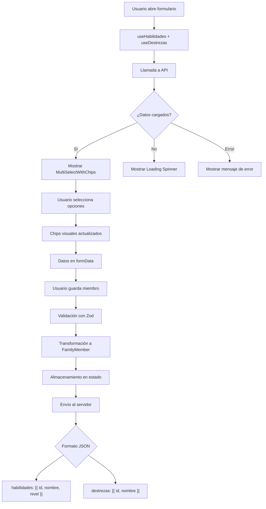

# 🎯 Implementación de Habilidades y Destrezas en Formulario de Familia

## 📋 Resumen de Implementación

Se ha implementado exitosamente la funcionalidad de **Habilidades Profesionales** y **Destrezas Técnicas** en el formulario de miembros de familia, permitiendo selección múltiple con visualización de chips y integración completa con la API.

---

## 🏗️ Arquitectura de la Solución

### 1. **Servicios API** (`src/services/`)

#### `habilidades.ts`
```typescript
export const habilidadesService = {
  getHabilidades()           // Obtener todas las habilidades
  getActiveHabilidades()     // Obtener solo habilidades activas
  searchHabilidades()        // Buscar habilidades por nombre
  getHabilidadById()         // Obtener habilidad específica por ID
}
```

**Endpoint**: `GET /api/catalog/habilidades`  
**Parámetros**:
- `includePersonas`: boolean (default: false)
- `orderBy`: string (default: 'nombre')
- `orderDirection`: 'ASC' | 'DESC' (default: 'ASC')

#### `destrezas.ts`
```typescript
export const destrezasService = {
  getDestrezas()             // Obtener todas las destrezas
  getActiveDestrezas()       // Obtener solo destrezas activas
  searchDestrezas()          // Buscar destrezas por nombre
  getDestrezaById()          // Obtener destreza específica por ID
}
```

**Endpoint**: `GET /api/catalog/destrezas`  
**Parámetros**:
- `includePersonas`: boolean (default: false)
- `orderBy`: string (default: 'nombre')
- `orderDirection`: 'ASC' | 'DESC' (default: 'ASC')

---

### 2. **Custom Hooks** (`src/hooks/`)

#### `useHabilidades.ts`
```typescript
export const useHabilidades = (): UseHabilidadesResult => {
  habilidades: Habilidad[]    // Array de habilidades disponibles
  isLoading: boolean          // Estado de carga
  error: string | null        // Mensaje de error si ocurre
  refetch: () => Promise<void> // Función para recargar datos
}
```

#### `useDestrezas.ts`
```typescript
export const useDestrezas = (): UseDestrezasResult => {
  destrezas: Destreza[]       // Array de destrezas disponibles
  isLoading: boolean          // Estado de carga
  error: string | null        // Mensaje de error si ocurre
  refetch: () => Promise<void> // Función para recargar datos
}
```

**Características**:
- ✅ Carga automática al montar el componente
- ✅ Manejo de estados de loading y error
- ✅ Función de recarga manual (refetch)
- ✅ Integración con interceptores de autenticación

---

### 3. **Componente UI Reutilizable** (`src/components/ui/`)

#### `multi-select-chips.tsx`
Componente de selección múltiple con visualización de chips y búsqueda integrada.

```typescript
interface MultiSelectWithChipsProps {
  options: MultiSelectOption[]      // Opciones disponibles
  value: MultiSelectOption[]        // Opciones seleccionadas
  onChange: (value: MultiSelectOption[]) => void
  placeholder?: string              // Texto cuando no hay selección
  searchPlaceholder?: string        // Placeholder del buscador
  emptyText?: string                // Texto cuando no hay resultados
  isLoading?: boolean               // Indicador de carga
  error?: string | null             // Mensaje de error
  disabled?: boolean                // Deshabilitar componente
  className?: string                // Clases CSS adicionales
}
```

**Características**:
- 🔍 **Búsqueda en tiempo real** con filtrado local
- 🏷️ **Chips visuales** para cada opción seleccionada
- ❌ **Botón de eliminar** individual por chip
- 🗑️ **Limpiar todo** cuando hay múltiples selecciones
- ♿ **Accesibilidad completa** con ARIA labels
- 🎨 **Diseño moderno** compatible con tema oscuro
- ⚡ **Performance optimizada** con `useMemo`

**Ejemplo de uso**:
```tsx
<MultiSelectWithChips
  options={habilidades}
  value={selectedHabilidades}
  onChange={setSelectedHabilidades}
  placeholder="Seleccionar habilidades..."
  searchPlaceholder="Buscar habilidad..."
  emptyText="No se encontraron habilidades"
  isLoading={habilidadesLoading}
  error={habilidadesError}
/>
```

---

### 4. **Tipos TypeScript** (`src/types/survey.ts`)

#### Actualización de `FamilyMember`
```typescript
export interface FamilyMember {
  // ... campos existentes ...
  
  // ✨ Nuevos campos
  habilidades: Array<{ 
    id: number; 
    nombre: string; 
    nivel?: string 
  }>;
  
  destrezas: Array<{ 
    id: number; 
    nombre: string 
  }>;
}
```

#### Tipos de Servicios
```typescript
// Habilidades
export interface Habilidad {
  id: number;
  nombre: string;
  nivel?: string;
  descripcion?: string;
  activo?: boolean;
}

// Destrezas
export interface Destreza {
  id: number;
  nombre: string;
  descripcion?: string;
  activo?: boolean;
}
```

---

### 5. **Validación con Zod** (`src/hooks/useFamilyGrid.ts`)

```typescript
const familyMemberSchema = z.object({
  // ... campos existentes ...
  
  // ✨ Validación de nuevos campos
  habilidades: z.array(z.object({
    id: z.number(),
    nombre: z.string(),
    nivel: z.string().optional(),
  })).default([]),
  
  destrezas: z.array(z.object({
    id: z.number(),
    nombre: z.string(),
  })).default([]),
});
```

---

### 6. **Integración en Formulario** (`src/components/survey/FamilyMemberDialog.tsx`)

Se agregó una **nueva sección (#9)** al formulario de miembros de familia:

```tsx
{/* SECCIÓN 9: HABILIDADES Y DESTREZAS (NUEVA) */}
<div className="p-6 bg-amber-50 dark:bg-amber-900/10 rounded-xl border border-amber-200 dark:border-amber-800">
  <h4 className="text-lg font-bold text-foreground mb-4 flex items-center gap-2">
    <Lightbulb className="w-5 h-5 text-amber-600" />
    Habilidades y Destrezas
  </h4>
  <p className="text-sm text-muted-foreground mb-4">
    Selecciona las habilidades profesionales y destrezas técnicas del miembro familiar
  </p>
  
  <div className="grid grid-cols-1 md:grid-cols-2 gap-4">
    {/* Campo Habilidades */}
    <FormField name="habilidades">
      <MultiSelectWithChips
        options={habilidades}
        value={field.value}
        onChange={field.onChange}
        ...
      />
    </FormField>
    
    {/* Campo Destrezas */}
    <FormField name="destrezas">
      <MultiSelectWithChips
        options={destrezas}
        value={field.value}
        onChange={field.onChange}
        ...
      />
    </FormField>
  </div>
</div>
```

**Ubicación**: Después de la sección "Información de Servicios y Liderazgo" (Sección #8)

---

## 📊 Flujo de Datos



---

## 🔄 Formato de Datos para API

### Ejemplo de JSON enviado al servidor:

```json
{
  "id_persona": 123,
  "nombres": "Juan Pérez",
  "habilidades": [
    {
      "id": 1,
      "nombre": "Comunicación efectiva",
      "nivel": "Avanzado"
    },
    {
      "id": 2,
      "nombre": "Trabajo en equipo",
      "nivel": "Intermedio"
    }
  ],
  "destrezas": [
    {
      "id": 3,
      "nombre": "Carpintería"
    },
    {
      "id": 4,
      "nombre": "Electricidad"
    }
  ]
}
```

---

## ✅ Características Implementadas

### Funcionales:
- ✅ Carga de datos desde endpoints de API
- ✅ Selección múltiple con chips visuales
- ✅ Búsqueda en tiempo real
- ✅ Validación de datos con Zod
- ✅ Persistencia en localStorage (borradores)
- ✅ Integración completa con formulario de familia
- ✅ Envío correcto al servidor en formato JSON

### UI/UX:
- ✅ Diseño moderno y consistente
- ✅ Soporte para tema oscuro
- ✅ Estados de loading
- ✅ Mensajes de error amigables
- ✅ Botones de eliminar individual
- ✅ Botón "Limpiar todo"
- ✅ Contador de elementos seleccionados
- ✅ Responsive design

### Accesibilidad:
- ✅ ARIA labels correctos
- ✅ Navegación por teclado
- ✅ Screen reader friendly
- ✅ Alto contraste
- ✅ Focus visible

---

## 🧪 Testing Manual

### Pasos para probar:

1. **Abrir formulario de encuesta**:
   ```
   http://localhost:8080/survey
   ```

2. **Navegar a Etapa 4**: "Información Familiar"

3. **Agregar nuevo miembro de familia**:
   - Click en "Agregar Miembro"
   - Completar campos obligatorios (nombres, tipo de identificación, número de identificación)

4. **Ir a Sección 9**: "Habilidades y Destrezas"

5. **Probar Habilidades**:
   - Click en selector de habilidades
   - Buscar "Comunicación"
   - Seleccionar múltiples opciones
   - Verificar que aparecen chips
   - Probar eliminar individual
   - Probar "Limpiar todo"

6. **Probar Destrezas**:
   - Click en selector de destrezas
   - Buscar "Carpintería"
   - Seleccionar múltiples opciones
   - Verificar chips

7. **Guardar miembro**:
   - Click en "Guardar"
   - Verificar que se agrega a la tabla

8. **Editar miembro**:
   - Click en "Editar" de la tabla
   - Verificar que habilidades y destrezas se cargan correctamente
   - Modificar selecciones
   - Guardar cambios

9. **Enviar encuesta**:
   - Completar todas las etapas
   - Enviar al servidor
   - Verificar en Network tab que el JSON incluye habilidades y destrezas

---

## 📝 Notas Importantes

### Campo Legacy:
Se mantiene el campo de texto `habilidadDestreza` por compatibilidad con datos existentes, pero se marca como "Campo Legacy" y se sugiere usar los nuevos campos de selección múltiple.

### Migración de Datos:
Los datos existentes que usen el campo de texto `habilidadDestreza` no se verán afectados. El sistema soporta ambos formatos simultáneamente.

### Performance:
- Los datos de habilidades y destrezas se cargan una sola vez al abrir el diálogo
- El filtrado de búsqueda es local (no hace llamadas a la API)
- Se usa `useMemo` para optimizar re-renders

### Manejo de Errores:
- Si falla la carga de habilidades, se muestra mensaje de error pero no bloquea el formulario
- Si falla la carga de destrezas, se muestra mensaje de error pero no bloquea el formulario
- Los campos son opcionales, no obligatorios

---

## 🔧 Archivos Modificados/Creados

### Nuevos Archivos:
```
✨ src/services/habilidades.ts
✨ src/services/destrezas.ts
✨ src/hooks/useHabilidades.ts
✨ src/hooks/useDestrezas.ts
✨ src/components/ui/multi-select-chips.tsx
```

### Archivos Modificados:
```
📝 src/types/survey.ts
📝 src/hooks/useFamilyGrid.ts
📝 src/components/survey/FamilyMemberDialog.tsx
```

---

## 🚀 Próximos Pasos (Opcional)

### Mejoras Futuras:
1. **Agregar nivel a destrezas**: Permitir especificar nivel de experiencia en destrezas
2. **Sugerencias inteligentes**: Basado en profesión seleccionada
3. **Estadísticas**: Dashboard de habilidades y destrezas más comunes
4. **Exportación**: Generar reportes de habilidades por sector
5. **Validación cruzada**: Validar que habilidades sean coherentes con profesión

---

## 📞 Soporte

Para dudas o problemas:
- Revisar logs del navegador (F12 > Console)
- Verificar Network tab para errores de API
- Revisar que el endpoint esté disponible y devuelva datos correctos
- Verificar autenticación con token válido

---

## ✅ Checklist de Verificación

- [x] Servicios API creados y funcionales
- [x] Hooks personalizados implementados
- [x] Componente MultiSelectWithChips creado
- [x] Tipos TypeScript actualizados
- [x] Validación Zod implementada
- [x] Formulario actualizado con nueva sección
- [x] Transformadores de datos actualizados
- [x] Sin errores de compilación
- [x] Servidor de desarrollo funcionando
- [x] Documentación completa

---

**Fecha de implementación**: 2025-01-10  
**Versión**: 1.0  
**Estado**: ✅ Completado y funcional
