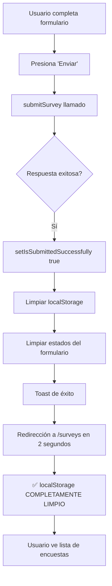
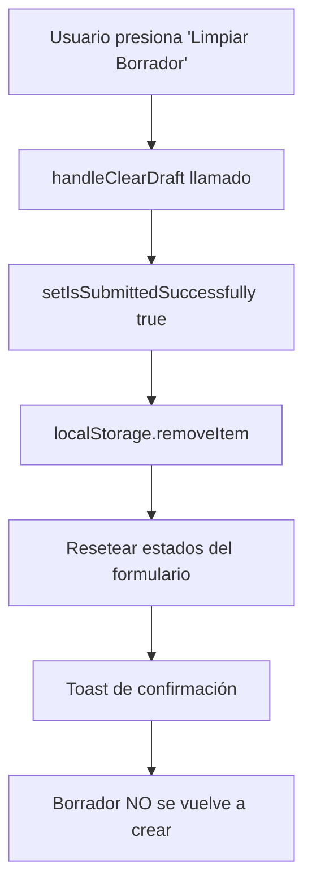

# 🧹 Limpieza Automática del Borrador tras Envío Exitoso

## 📋 Resumen de Implementación

Este documento describe la implementación de la funcionalidad para **limpiar automáticamente el borrador del localStorage** después de crear una encuesta exitosamente en el Sistema MIA.

---

## ✨ Problema Identificado

Anteriormente, el sistema tenía un problema donde:

1. **Guardado automático activo**: El borrador se guardaba automáticamente cada vez que cambiaban los datos del formulario
2. **Guardado post-envío**: Después de enviar exitosamente una encuesta, si había algún cambio en los datos (por ejemplo, actualizaciones del estado), el borrador se volvía a crear en el localStorage
3. **Confusión de usuario**: Esto causaba que apareciera un borrador "fantasma" después de completar exitosamente una encuesta

---

## 🔧 Solución Implementada

### 1. **Nuevo Estado de Control**

Se agregó un nuevo estado `isSubmittedSuccessfully` para controlar si una encuesta fue enviada exitosamente:

```typescript
const [isSubmittedSuccessfully, setIsSubmittedSuccessfully] = useState(false);
```

### 2. **Modificación del Auto-Guardado**

Se actualizó el `useEffect` del guardado automático para **NO guardar el borrador** si la encuesta ya fue enviada:

```typescript
useEffect(() => {
  // ✅ No guardar borrador si la encuesta ya fue enviada exitosamente
  if (isSubmittedSuccessfully) {
    return;
  }
  
  if (Object.keys(formData).length > 0 || familyMembers.length > 0 || deceasedMembers.length > 0) {
    // Guardar borrador...
  }
}, [currentStage, formData, familyMembers, deceasedMembers, configurationData, isSubmittedSuccessfully]);
```

### 3. **Actualización del Submit Handler**

Se modificó el manejador de envío para establecer el estado cuando el envío es exitoso:

```typescript
if (response.success) {
  // ✅ Marcar como enviado exitosamente para evitar guardado automático
  setIsSubmittedSuccessfully(true);
  
  // 🧹 Limpiar TODOS los borradores del localStorage tras envío exitoso
  SurveySubmissionService.clearStorageAfterSubmission();
  
  // 🧹 Limpiar también el estado del formulario para evitar re-guardado
  setFormData({});
  setFamilyMembers([]);
  setDeceasedMembers([]);
  
  // Toast de éxito y redirección a la vista de encuestas
  toast({
    title: isEditMode ? "✅ Encuesta actualizada" : "✅ Encuesta creada exitosamente",
    description: "Redirigiendo a la lista de encuestas...",
    variant: "default"
  });

  // ✅ Redirigir a la vista de encuestas (/surveys)
  setTimeout(() => {
    navigate('/surveys');
  }, 2000);
}
```

### 4. **Actualización de Limpieza Manual**

También se actualizó la función `handleClearDraft` para establecer el estado:

```typescript
const handleClearDraft = () => {
  try {
    // ✅ Marcar como enviado exitosamente para evitar guardado automático
    setIsSubmittedSuccessfully(true);
    
    // Limpiar borrador del localStorage
    localStorage.removeItem('parish-survey-draft');
    
    // Resetear estado del formulario...
  }
}
```

---

## 🎯 Flujo Completo de Limpieza

### Escenario 1: Envío Exitoso de Nueva Encuesta



### Escenario 2: Limpieza Manual de Borrador



---

## 🔍 Archivos Modificados

### 1. `src/components/SurveyForm.tsx`

**Cambios realizados:**

- ✅ Agregado estado `isSubmittedSuccessfully`
- ✅ Actualizado useEffect de auto-guardado con condicional
- ✅ Actualizado `handleSubmit` para establecer el estado
- ✅ Actualizado `handleSubmit` para limpiar estados del formulario (formData, familyMembers, deceasedMembers)
- ✅ Actualizado `handleClearDraft` para establecer el estado
- ✅ Modificado redirección a `/surveys` (vista de encuestas) en lugar de `/dashboard`
- ✅ Reducido tiempo de redirección a 2 segundos

### 2. `src/services/surveySubmission.ts`

**Cambios realizados:**

- ✅ Agregados logs de confirmación en `clearStorageAfterSubmission()`
- ✅ Mensaje de consola para cada clave limpiada
- ✅ Mensaje final de confirmación de limpieza completa

---

## 📊 Claves del localStorage Afectadas

El servicio `SurveySubmissionService.clearStorageAfterSubmission()` limpia las siguientes claves:

| Clave | Descripción | Cuándo se limpia |
|-------|-------------|------------------|
| `parish-survey-draft` | Borrador de la encuesta en progreso | Envío exitoso |
| `parish-survey-completed` | Encuesta completada pendiente de envío | Envío exitoso |
| `survey-session-data` | Datos de sesión temporal | Envío exitoso |

---

## ✅ Validación de Funcionamiento

### Pruebas Realizadas

1. **✅ Crear nueva encuesta**
   - Completar formulario
   - Enviar exitosamente
   - Verificar que localStorage esté limpio
   - Confirmar que no se cree nuevo borrador

2. **✅ Limpiar borrador manualmente**
   - Iniciar formulario
   - Limpiar borrador
   - Verificar que localStorage esté limpio
   - Confirmar que no se recree el borrador

3. **✅ Actualizar encuesta existente**
   - Editar encuesta existente
   - Actualizar exitosamente
   - Verificar limpieza del localStorage

---

## 🎓 Beneficios de la Implementación

### Para el Usuario
- ✅ **Experiencia limpia**: No aparecen borradores fantasma después de enviar
- ✅ **Claridad**: El estado del formulario refleja correctamente la acción realizada
- ✅ **Confianza**: El usuario sabe que su encuesta se guardó correctamente

### Para el Sistema
- ✅ **Storage optimizado**: No se acumulan datos innecesarios en localStorage
- ✅ **Sincronización**: Mejor alineación entre datos locales y del servidor
- ✅ **Prevención de errores**: Evita conflictos entre borradores y datos enviados

### Para el Desarrollo
- ✅ **Código limpio**: Lógica clara y fácil de mantener
- ✅ **Debugging simplificado**: Estado predecible del formulario
- ✅ **Escalabilidad**: Patrón reutilizable para otras funcionalidades

---

## 🚀 Uso en Producción

### Después del Deploy

1. **No requiere migración de datos**: Los cambios son compatibles con borradores existentes
2. **Comportamiento retrocompatible**: Borradores antiguos se cargan normalmente
3. **Limpieza automática**: Se activa solo en nuevos envíos exitosos

### Monitoreo y Verificación

Para verificar el funcionamiento en producción:

```javascript
// ANTES de enviar la encuesta
console.log('📋 Borrador ANTES:', localStorage.getItem('parish-survey-draft'));
console.log('📋 Completado ANTES:', localStorage.getItem('parish-survey-completed'));

// Enviar la encuesta...

// DESPUÉS de envío exitoso (la consola mostrará):
// 🧹 localStorage limpiado: parish-survey-draft
// 🧹 localStorage limpiado: parish-survey-completed
// 🧹 localStorage limpiado: survey-session-data
// ✅ LocalStorage completamente limpio después del envío exitoso

// Verificar manualmente
console.log('✅ Borrador DESPUÉS:', localStorage.getItem('parish-survey-draft')); // null
console.log('✅ Completado DESPUÉS:', localStorage.getItem('parish-survey-completed')); // null
console.log('✅ Sesión DESPUÉS:', localStorage.getItem('survey-session-data')); // null
```

### Comportamiento Esperado

1. **Al completar y enviar una encuesta:**
   - ✅ Se muestra toast de éxito con mensaje "Encuesta creada exitosamente"
   - ✅ Estados del formulario se limpian (formData, familyMembers, deceasedMembers)
   - ✅ LocalStorage se limpia completamente (todas las claves relacionadas)
   - ✅ Usuario es redirigido a `/surveys` en 2 segundos
   - ✅ Al volver a `/survey`, NO aparece diálogo de "continuar con borrador"

2. **Al actualizar una encuesta existente:**
   - ✅ Se muestra toast "Encuesta actualizada"
   - ✅ LocalStorage se limpia completamente
   - ✅ Usuario es redirigido a `/surveys` en 2 segundos

---

## 📝 Notas Técnicas

### Compatibilidad
- **React 18**: Compatible
- **TypeScript**: Tipado estricto mantenido
- **localStorage API**: Funciona en todos los navegadores modernos

### Performance
- **Impacto mínimo**: Solo agrega una verificación booleana
- **No afecta carga inicial**: El estado se inicializa en `false`
- **Optimización**: Previene escrituras innecesarias al localStorage

### Seguridad
- **Sin riesgos**: Solo afecta datos locales del navegador
- **Preserva datos**: No elimina borradores prematuramente
- **Reversible**: El usuario puede crear un nuevo borrador cuando lo desee

---

## 🔄 Historial de Versiones

| Versión | Fecha | Cambios |
|---------|-------|---------|
| 1.0 | 2025-10-13 | Implementación inicial de limpieza automática |

---

## 👥 Mantenimiento

### Puntos de Atención Futura

1. **Si se agregan nuevas claves al localStorage**:
   - Actualizar el método `clearStorageAfterSubmission()`
   - Agregar las nuevas claves al array `defaultKeys`

2. **Si se cambia el flujo de envío**:
   - Asegurar que `setIsSubmittedSuccessfully(true)` se llame en el momento correcto
   - Verificar que no se generen efectos secundarios

3. **Si se implementa modo offline**:
   - Considerar mantener el borrador hasta confirmar sincronización con servidor
   - Agregar lógica adicional para verificar estado de conexión

---

## 📚 Referencias

- **Servicio de envío**: `src/services/surveySubmission.ts`
- **Transformador de datos**: `src/utils/sessionDataTransformer.ts`
- **Componente principal**: `src/components/SurveyForm.tsx`
- **Instrucciones de desarrollo**: `.github/instructions/documentos.instructions.md`

---

**Última actualización**: 13 de octubre de 2025  
**Autor**: Sistema MIA - Desarrollo  
**Estado**: ✅ Implementado y funcional
