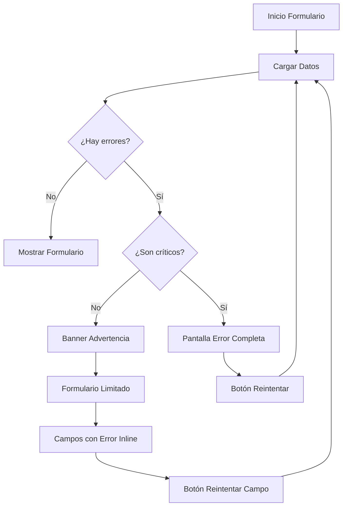

# 📋 Mejoras en el Manejo de Errores del Formulario de Encuestas

## 🎯 Resumen de Cambios

Se ha implementado un sistema robusto para manejar errores en la carga de servicios del formulario de encuestas, proporcionando información clara y específica cuando fallan los servicios de datos.

## 🛠️ Componentes Implementados

### 1. ServiceErrorDisplay (`src/components/ui/service-error-display.tsx`)

Componente reutilizable para mostrar errores de servicios de forma consistente.

**Características:**
- ✅ Detección automática del tipo de error (red, timeout, servidor, autenticación, etc.)
- ✅ Mensajes específicos según el tipo de fallo
- ✅ Iconos apropiados para cada tipo de error
- ✅ Botón de reintento opcional
- ✅ Modo inline y completo
- ✅ Tamaños configurables (sm, md, lg)
- ✅ Compatible con tema oscuro

**Tipos de error detectados:**
- 🌐 **Error de Conexión**: Problemas de red o conectividad
- ⏱️ **Timeout**: Servidor lento en responder
- 🔍 **Recurso No Encontrado** (404): Servicio no disponible
- 🔧 **Error del Servidor** (500+): Problemas internos del servidor
- 🔐 **Autenticación** (401/403): Permisos insuficientes
- ⚠️ **Error Genérico**: Otros tipos de errores

### 2. FormDataLoadingError (`src/components/survey/FormDataLoadingError.tsx`)

Componente especializado para mostrar errores múltiples en el formulario de encuestas.

**Características:**
- ✅ Clasificación de servicios críticos vs no críticos
- ✅ Alertas diferenciadas por severidad
- ✅ Información sobre el impacto en el formulario
- ✅ Botón para reintentar carga de todos los servicios
- ✅ Lista detallada de servicios fallidos

**Servicios críticos monitoreados:**
- 🏛️ Municipios (ubicación geográfica)
- ⛪ Parroquias (identificación parroquial)
- 📍 Sectores (ubicación específica)

**Servicios no críticos monitoreados:**
- 🏘️ Veredas, Tipos de Vivienda, Disposición de Basura
- 🚰 Aguas Residuales, Sistemas de Acueducto
- 👥 Sexos, Estados Civiles

### 3. Hook useServiceRetry (`src/hooks/useServiceRetry.ts`)

Hook personalizado para manejar reintentos automáticos de servicios.

**Funcionalidades:**
- ✅ Reintentos automáticos con delay configurable
- ✅ Límite máximo de reintentos
- ✅ Estados de loading y contador de intentos
- ✅ Notificaciones toast integradas
- ✅ Reseteo de contadores tras éxito

## 🔧 Mejoras en Componentes Existentes

### StandardFormField.tsx
- ✅ Integración con `ServiceErrorDisplay` para errores inline
- ✅ Spinner mejorado para estados de carga
- ✅ Mensajes de error más informativos

### SurveyForm.tsx
- ✅ Detección de errores críticos que impiden usar el formulario
- ✅ Pantalla completa de error para fallos críticos
- ✅ Advertencias no intrusivas para errores menores
- ✅ Botón de reintento para recargar datos

## 📱 Estados de la Interfaz

### 1. Carga Normal
```
┌─────────────────────────────────────┐
│ [Spinner] Cargando datos...         │
│ ● Sectores ● Parroquias ● Municipios│
└─────────────────────────────────────┘
```

### 2. Error Crítico (Pantalla Completa)
```
┌─────────────────────────────────────┐
│ ⚠️  Error Crítico en Carga de Datos │
│                                     │
│ ❌ Municipios: Error de conexión    │
│ ❌ Parroquias: Servidor no responde │
│                                     │
│ [🔄 Reintentar Carga de Datos]     │
└─────────────────────────────────────┘
```

### 3. Advertencia (Banner Superior)
```
┌─────────────────────────────────────┐
│ ⚠️  Algunos servicios no disponibles│
│ ⚠️ Veredas: Error de carga          │
│ [🔄 Reintentar]                     │
└─────────────────────────────────────┘
│                                     │
│ [Formulario funcional con limitaciones]
```

### 4. Error en Campo Específico
```
Campo: Tipos de Vivienda *
┌─────────────────────────────────────┐
│ 📶❌ Error de conexión al cargar    │
│     tipos de vivienda [🔄 Reintentar]│
└─────────────────────────────────────┘
```

## 🎨 Estilos y Tema

- **Colores específicos por tipo de error**:
  - ❌ Crítico: `text-destructive` (rojo del sistema)
  - ⚠️ Advertencia: `text-orange-600` 
  - 🔄 Carga: `text-muted-foreground`

- **Compatibilidad con tema oscuro** completa
- **Animaciones sutiles** en spinners y transiciones
- **Espaciado consistente** con el sistema de diseño MIA

## 🔄 Flujo de Manejo de Errores



## 🧪 Casos de Prueba

### Test de Errores de Red
```typescript
// Simular error de conexión
mock.onGet('/api/municipios').networkError();
// Resultado: Pantalla de error crítico con mensaje de conectividad
```

### Test de Error 500
```typescript
// Simular error del servidor
mock.onGet('/api/sectores').reply(500, { message: 'Internal Server Error' });
// Resultado: Error crítico con mensaje de servidor
```

### Test de Error No Crítico
```typescript
// Simular error en servicio no crítico
mock.onGet('/api/veredas').reply(404);
// Resultado: Banner de advertencia, formulario funcional
```

## 📝 Mensajes de Error Personalizados

### Por Tipo de Error
- **🌐 Red**: "No se pudo conectar al servidor. Verifique su conexión a internet."
- **⏱️ Timeout**: "El servidor tardó demasiado en responder. Intente nuevamente."
- **🔍 404**: "El servicio no está disponible en este momento."
- **🔧 500**: "Hubo un problema en el servidor. Intente más tarde."
- **🔐 Auth**: "No tiene permisos para acceder. Contacte al administrador."

### Por Servicio
- **Municipios**: "Necesario para ubicación geográfica"
- **Parroquias**: "Necesario para identificar la parroquia"
- **Sectores**: "Necesario para ubicación dentro de la parroquia"
- **Veredas**: "Ubicación rural opcional"

## 🚀 Beneficios para el Usuario

1. **🎯 Información Clara**: Mensajes específicos sobre qué falló y por qué
2. **🔄 Recuperación Fácil**: Botones de reintento accesibles
3. **⚡ Funcionalidad Progresiva**: El formulario funciona incluso con algunos errores
4. **📱 Experiencia Consistente**: Manejo uniforme de errores en toda la aplicación
5. **🌙 Accesibilidad**: Compatible con tema oscuro y lectores de pantalla

## 🔮 Posibles Mejoras Futuras

- [ ] **Retry inteligente**: Diferentes estrategias según el tipo de error
- [ ] **Caché offline**: Guardar datos previamente cargados
- [ ] **Métricas de error**: Envío de analytics sobre fallos frecuentes
- [ ] **Modo degradado**: Opciones estáticas cuando todos los servicios fallan
- [ ] **Predicción de errores**: Avisos preventivos antes de que ocurran fallos

---

## 📚 Documentación Técnica

### Archivos Modificados
- ✅ `src/components/ui/service-error-display.tsx` (nuevo)
- ✅ `src/components/survey/FormDataLoadingError.tsx` (nuevo)
- ✅ `src/hooks/useServiceRetry.ts` (nuevo)
- ✅ `src/components/survey/StandardFormField.tsx` (mejorado)
- ✅ `src/components/SurveyForm.tsx` (mejorado)

### Dependencias Agregadas
- Ninguna (utiliza componentes existentes de shadcn/ui)

### Compatibilidad
- ✅ React 18+
- ✅ TypeScript 5+
- ✅ Vite 7+
- ✅ Tailwind CSS 3+
- ✅ Tema oscuro completo